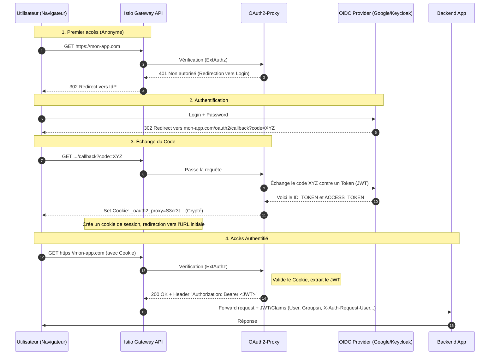

Aujourd'hui, on va plonger dans un sujet complexe : comment sécuriser vos applications avec oauth2-proxy, Istio et OIDC, en utilisant la nouvelle Gateway API (le successeur moderne de l’Ingress NGINX). On va voir ensemble les concepts, le flux d’authentification, et plusieurs façons de mettre en place l’autorisation avec Istio, en analysant leurs avantages et limites.

## Présentation des technos

Avant de coder, il faut bien comprendre le rôle de chaque brique.

**OAuth2** : C’est un protocole standard qui permet à une application d’obtenir un accès limité à des ressources sur un serveur, sans partager les identifiants de l’utilisateur. Il délègue l’authentification à un fournisseur d’identité (IdP) comme Google, Keycloak, etc.

**OIDC (OpenID Connect)** : C’est une surcouche d’OAuth2 qui ajoute une couche d’authentification. L’utilisateur s’authentifie auprès de l’IdP, et l’application reçoit un jeton d’identité (ID token) au format JWT (JSON Web Token). Ce jeton contient des claims (informations) sur l’utilisateur : `email`, `groupes`, s`ub, `roles`, etc.

En résumé :

- OAuth2 = "est-ce que cette app a le droit de faire ça ?"
- OIDC = "qui est l'utilisateur, et quels sont ses attributs ?"

**oauth2-proxy** : C’est un reverse proxy léger qui s’interpose entre l’utilisateur et votre application. Il gère toute la danse OAuth2/OIDC : redirection vers l’IdP, réception du code, échange contre un token, création d’une session (via un cookie) et injection d’en-têtes HTTP vers l’application (comme `X-Auth-Request-User`, `X-Auth-Request-Groups`, voire le `JWT` lui-même). C’est lui qui rend l’authentification transparente pour votre application.

**Istio** : C’est un service mesh qui ajoute un proxy sidecar (Envoy) à chaque pod. Il permet de gérer finement le trafic, la sécurité (mTLS, autorisation) et l’observabilité. Grâce à ses CRD (Custom Resource Definitions), on peut définir des politiques d’authentification et d’autorisation au niveau du mesh.
    
On en reparlera plus tard, mais avec les CRDs `RequestAuthentication` et `AuthorizationPolicy` d'Istio, tu peux valider des JWTs et contrôler l'accès à tes services directement dans le mesh, sans toucher au code applicatif.

**Gateway API**: C’est la nouvelle norme pour exposer des services à l’extérieur du cluster Kubernetes. Elle remplace les anciennes Ingress (comme NGINX Ingress) en étant plus expressive, orientée rôle (séparation entre l’opérateur réseau et le développeur) et compatible avec plusieurs implémentations (dont Istio). Avec Istio, on utilise la Gateway API pour configurer le point d’entrée du mesh.

Elle s'articule autour de trois ressources principales :

- `GatewayClass` — définit le type de gateway (Istio, Contour, Traefik…)
- `Gateway` — déploie une instance de gateway avec ses listeners (ports, TLS…)
- `HTTPRoute` — définit les règles de routage (quel path va vers quel service)

Istio a une implémentation complète de la Gateway API. C'est la direction prise par l'écosystème, et c'est ce qu'on va utiliser ici.

## Diagramme de séquence global
C'est souvent là que ça devient flou. Voici le flow complet, depuis le premier clic de l'utilisateur jusqu'à la réponse de ton application backend.

Imaginons qu’un utilisateur veuille accéder à votre application mon-app.example.com :

Ce qu'il faut retenir du flow :

Le **cookie** est posé par oauth2-proxy après le callback OIDC. Il contient la session chiffrée (avec les tokens). C'est lui qui permet à oauth2-proxy de reconnaître l'utilisateur sur les requêtes suivantes, sans retourner à l'IdP à chaque fois.

L'**Authorization header** (`Bearer <JWT>`) est injecté par oauth2-proxy sur chaque requête forwardée vers l'upstream. C'est ce header que Istio va utiliser pour valider le JWT et extraire les claims.

Les **claims** (comme `groups`) sont extraits du JWT par Istio via la `RequestAuthentication`. Ils deviennent alors disponibles dans `request.auth.claims` pour les `AuthorizationPolicy`. On peut aussi demander à Istio d'insérer des entête spécifiques comme `X-Auth-Request-Groups`, etc.