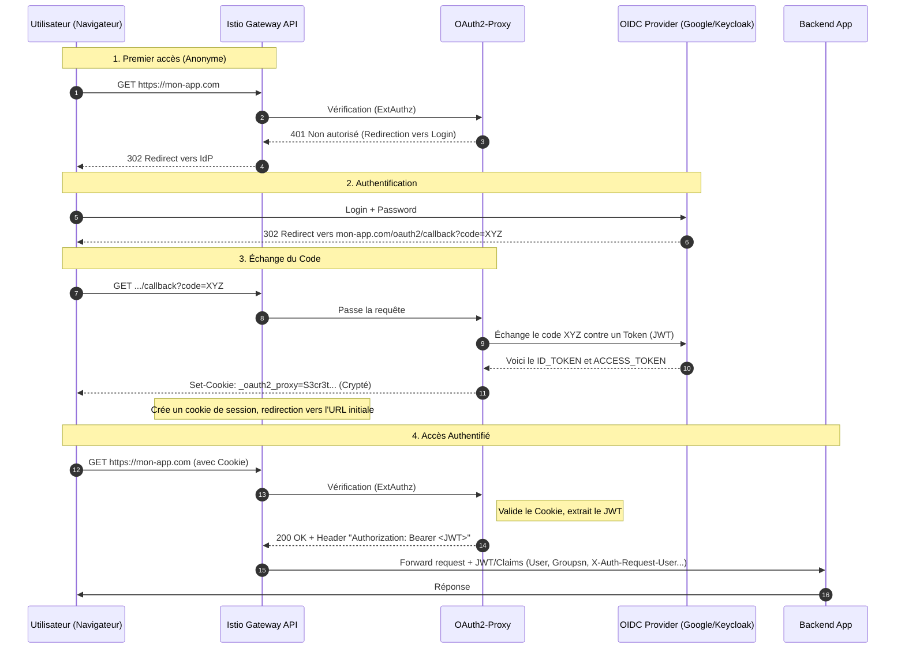

Aujourd'hui, on va plonger dans un sujet complexe : comment sécuriser vos applications avec oauth2-proxy, Istio et OIDC, en utilisant la nouvelle Gateway API (le successeur moderne de l’Ingress NGINX). On va voir ensemble les concepts, le flux d’authentification, et plusieurs façons de mettre en place l’autorisation avec Istio, en analysant leurs avantages et limites.

## Présentation des technos

Avant de coder, il faut bien comprendre le rôle de chaque brique.


**OAuth2** : C’est un protocole standard qui permet à une application d’obtenir un accès limité à des ressources sur un serveur, sans partager les identifiants de l’utilisateur. Il délègue l’authentification à un fournisseur d’identité (IdP) comme Google, Keycloak, etc.

**OIDC (OpenID Connect)** : C’est une surcouche d’OAuth2 qui ajoute une couche d’authentification. L’utilisateur s’authentifie auprès de l’IdP, et l’application reçoit un jeton d’identité (ID token) au format JWT (JSON Web Token). Ce jeton contient des claims (informations) sur l’utilisateur : `email`, `groupes`, s`ub, `roles`, etc.

En résumé :

- OAuth2 = "est-ce que cette app a le droit de faire ça ?"
- OIDC = "qui est l'utilisateur, et quels sont ses attributs ?"

**oauth2-proxy** : C’est un reverse proxy léger qui s’interpose entre l’utilisateur et votre application. Il gère toute la danse OAuth2/OIDC : redirection vers l’IdP, réception du code, échange contre un token, création d’une session (via un cookie) et injection d’en-têtes HTTP vers l’application (comme `X-Auth-Request-User`, `X-Auth-Request-Groups`, voire le `JWT` lui-même). C’est lui qui rend l’authentification transparente pour votre application.

**Istio** : C’est un service mesh qui ajoute un proxy sidecar (Envoy) à chaque pod. Il permet de gérer finement le trafic, la sécurité (mTLS, autorisation) et l’observabilité. Grâce à ses CRD (Custom Resource Definitions), on peut définir des politiques d’authentification et d’autorisation au niveau du mesh.
    
On en reparlera plus tard, mais avec les CRDs `RequestAuthentication` et `AuthorizationPolicy` d'Istio, tu peux valider des JWTs et contrôler l'accès à tes services directement dans le mesh, sans toucher au code applicatif.

**Gateway API**: C’est la nouvelle norme pour exposer des services à l’extérieur du cluster Kubernetes. Elle remplace les anciennes Ingress (comme NGINX Ingress) en étant plus expressive, orientée rôle (séparation entre l’opérateur réseau et le développeur) et compatible avec plusieurs implémentations (dont Istio). Avec Istio, on utilise la Gateway API pour configurer le point d’entrée du mesh.

Elle s'articule autour de trois ressources principales :

- `GatewayClass` — définit le type de gateway (Istio, Contour, Traefik…)
- `Gateway` — déploie une instance de gateway avec ses listeners (ports, TLS…)
- `HTTPRoute` — définit les règles de routage (quel path va vers quel service)

Istio a une implémentation complète de la Gateway API. C'est la direction prise par l'écosystème, et c'est ce qu'on va utiliser ici.


## Diagramme de séquence global
C'est souvent là que ça devient flou. Voici le flow complet, depuis le premier clic de l'utilisateur jusqu'à la réponse de ton application backend.

Imaginons qu’un utilisateur veuille accéder à votre application mon-app.example.com :




Ce qu'il faut retenir du flow :

Le **cookie** est posé par oauth2-proxy après le callback OIDC. Il contient la session chiffrée (avec les tokens). C'est lui qui permet à oauth2-proxy de reconnaître l'utilisateur sur les requêtes suivantes, sans retourner à l'IdP à chaque fois.

L'**Authorization header** (`Bearer <JWT>`) est injecté par oauth2-proxy sur chaque requête forwardée vers l'upstream. C'est ce header que Istio va utiliser pour valider le JWT et extraire les claims.

Les **claims** (comme `groups`) sont extraits du JWT par Istio via la `RequestAuthentication`. Ils deviennent alors disponibles dans `request.auth.claims` pour les `AuthorizationPolicy`. On peut aussi demander à Istio d'insérer des entête spécifiques comme `X-Auth-Request-Groups`, etc.


## Les différentes façons de sécuriser — et leurs limites

On va voir trois approches, de la moins robuste à la plus propre. Chacune a ses cas d'usage et ses pièges.

Je te montre ici le cheminement que j'ai pu suivre lors de mes expérimentations.


### Approche 1 ✅ La façon optimale — `RequestAuthentication` + double `AuthorizationPolicy`

C'est l'approche recommandée. Elle repose entièrement sur la validation du JWT par Istio, sans dépendre des headers HTTP injectés par oauth2-proxy.

#### Comment ça marche ?

**Étape 1 — `RequestAuthentication` : valider le JWT**

```yaml
apiVersion: security.istio.io/v1
kind: RequestAuthentication
metadata:
  name: jwt-validation
  namespace: mon-app
spec:
  selector:
    matchLabels:
      app: mon-app-backend
  jwtRules:
    - issuer: "https://keycloak.example.com/realms/myrealm"
      jwksUri: "https://keycloak.example.com/realms/myrealm/protocol/openid-connect/certs"
      # Istio va lire le JWT depuis l'Authorization header
      # et populer request.auth.claims avec les claims du token
```

Cette CRD dit à Istio : "si tu vois un JWT dans le header `Authorization`, valide-le avec ces JWKS. Si le token est invalide, rejette la requête. Si pas de token du tout, laisse passer (pour l'instant)."

**Étape 2 — `AuthorizationPolicy` de type CUSTOM (appel à oauth2-proxy pour l'auth)**

```yaml
apiVersion: security.istio.io/v1
kind: AuthorizationPolicy
metadata:
  name: oauth2-proxy-authz
  namespace: mon-app
spec:
  selector:
    matchLabels:
      app: mon-app-backend
  action: CUSTOM
  provider:
    name: oauth2-proxy  # défini dans meshconfig extensionProviders
  rules:
    - to:
        - operation:
            notPaths: ["/health", "/metrics", "/oauth2/"]
```

Cette première policy délègue à oauth2-proxy la vérification de la session (est-ce que l'utilisateur est connecté ?). Si le cookie est absent ou invalide, oauth2-proxy redirige vers l'IdP.

!!! info
    Pensez à ajouter le `oauth2` dans le `notPaths` afin de ne pas bloquer le login

**Étape 3 — `AuthorizationPolicy` de type ALLOW (vérification du claim `groups`)**

```yaml
apiVersion: security.istio.io/v1
kind: AuthorizationPolicy
metadata:
  name: require-admin-group
  namespace: mon-app
spec:
  selector:
    matchLabels:
      app: mon-app-backend
  action: ALLOW
  rules:
    - when:
        - key: request.auth.claims[groups]
          values: ["admin"]
```

Cette deuxième policy vérifie que le JWT contient le claim `groups: admin`. Elle s'appuie sur `request.auth.claims` — c'est-à-dire les claims extraits **directement du JWT validé par Istio**, pas sur un header HTTP.

> **Pourquoi deux AuthorizationPolicy ?**
> 
> Parce qu'Istio évalue les policies dans cet ordre : CUSTOM → DENY → ALLOW. Pour qu'une requête passe, elle doit satisfaire la CUSTOM (authentication), et il doit exister au moins une ALLOW qui matche. C'est le double verrou.

#### Configuration du `meshconfig` (extensionProvider)

Pour que la CUSTOM policy fonctionne, il faut déclarer oauth2-proxy comme extension provider dans la config Istio :

```yaml
apiVersion: v1
kind: ConfigMap
metadata:
  name: istio
  namespace: istio-system
data:
  mesh: |
    extensionProviders:
    - name: oauth2-proxy
      envoyExtAuthzHttp:
        service: oauth2-proxy.oauth2-proxy.svc.cluster.local
        port: 80
        includeRequestHeadersInCheck:
          - cookie
          - authorization
        headersToUpstreamOnAllow:
          - authorization
          - x-auth-request-user
          - x-auth-request-email
          - x-auth-request-groups
        headersToDownstreamOnDeny:
          - content-type
          - set-cookie
```

**Pourquoi c'est la façon optimale ?**

- La validation du JWT se fait dans le mesh, cryptographiquement, via les JWKS publics de l'IdP
- Les claims viennent directement du token signé, pas d'un header HTTP (qui pourrait être falsifié)
- La redirection vers l'IdP est gérée par oauth2-proxy via la CUSTOM policy
- C'est propre, maintenable, et aligné avec les best practices Istio


### Approche 2 ❌ Non concluant — `AuthorizationPolicy` CUSTOM seule sur `request.headers[x-auth-request-groups]`

C'est l'approche "naïve" qu'on essaie souvent en premier. Elle paraît simple, mais elle a un défaut rédhibitoire.

#### La logique

oauth2-proxy injecte le header `X-Auth-Request-Groups` avec les groupes de l'utilisateur. On se dit : "je n'ai qu'à vérifier ce header dans mon AuthorizationPolicy."

```yaml
apiVersion: security.istio.io/v1
kind: AuthorizationPolicy
metadata:
  name: check-groups-header
  namespace: mon-app
spec:
  selector:
    matchLabels:
      app: mon-app-backend
  action: CUSTOM
  provider:
    name: oauth2-proxy
  rules:
    - when:
        - key: request.headers[x-auth-request-groups]
          values: ["admin"]
```

#### Pourquoi ça ne marche pas bien

**Problème 1 : multi-valeurs dans le claim `groups`**

Quand un utilisateur appartient à plusieurs groupes, l'IdP renvoie quelque chose comme :

```json
{
  "groups": ["admin", "dev-team", "ops"]
}
```

oauth2-proxy va concaténer ça dans le header : `X-Auth-Request-Groups: admin,dev-team,ops`

Et là, la `AuthorizationPolicy` compare la **valeur exacte** du header. Elle cherche `"admin"`, elle trouve `"admin,dev-team,ops"`. Ça ne matche pas.

**Problème 2 : pas de support du regex dans les values inline**

La CRD `AuthorizationPolicy` ne supporte pas les expressions régulières dans les comparaisons de headers pour les actions CUSTOM. Tu ne peux pas écrire `values: [".*admin.*"]` et espérer que ça fonctionne.

> **Conclusion :** Cette approche ne fonctionne **que si ton IdP renvoie exactement un seul groupe** dans le claim. Dès qu'un utilisateur a plusieurs groupes (cas réel quasi-systématique), c'est mort. Ne l'utilise pas en production.


### Approche 3 ⚠️ Fonctionnel, mais avec duplication — `extensionProviders` + query param dans l'auth URL

Cette approche contourne le problème des multi-groupes en déléguant le filtrage par groupe directement à oauth2-proxy.

#### La logique

oauth2-proxy supporte un paramètre dans son `--upstream` ou dans l'URL d'auth : `allowed_groups`. On peut passer le groupe attendu directement dans l'URL de vérification.

Dans le meshconfig Istio, on configure un `extensionProvider` **par groupe** :

```yaml
extensionProviders:
- name: oauth2-proxy-admin
  envoyExtAuthzHttp:
    service: oauth2-proxy.oauth2-proxy.svc.cluster.local
    port: 80
    pathPrefix: "/oauth2/auth?allowed_groups=admin"
    includeRequestHeadersInCheck:
      - cookie
      - authorization
    headersToUpstreamOnAllow:
      - authorization
      - x-auth-request-user
      - x-auth-request-email

- name: oauth2-proxy-dev-team
  envoyExtAuthzHttp:
    service: oauth2-proxy.oauth2-proxy.svc.cluster.local
    port: 80
    pathPrefix: "/oauth2/auth?allowed_groups=dev-team"
    includeRequestHeadersInCheck:
      - cookie
      - authorization
    headersToUpstreamOnAllow:
      - authorization
      - x-auth-request-user
      - x-auth-request-email
```

Puis dans les AuthorizationPolicy :

```yaml
# Policy pour l'app admin
apiVersion: security.istio.io/v1
kind: AuthorizationPolicy
metadata:
  name: require-admin
  namespace: admin-app
spec:
  action: CUSTOM
  provider:
    name: oauth2-proxy-admin  # utilise le provider dédié admin
  rules:
    - to:
        - operation:
            notPaths: ["/health"]
```

#### Pourquoi ça fonctionne

oauth2-proxy reçoit la requête de vérification avec le query param `?allowed_groups=admin`. Il vérifie lui-même dans le token si l'utilisateur appartient à ce groupe — et gère correctement les claims multi-valeurs, car c'est sa responsabilité.

#### Le problème : la duplication

Tu dois créer **un `extensionProvider` par groupe différent** dans ton meshconfig. Et le meshconfig Istio, c'est une ConfigMap globale dans `istio-system`. Autrement dit :

- Autant de apps avec des groups différents → autant d'entries dans le meshconfig
- Si tu as 10 teams avec 10 groupes distincts → 10 extensionProviders, 10 AuthorizationPolicies CUSTOM
- Chaque ajout/modif de groupe nécessite un redéploiement du meshconfig (et donc un reload Istio)

C'est viable pour des setups petits et stables, mais ça ne scale pas.


### Approche 4 ❌ Ne fonctionne pas — `RequestAuthentication` + `AuthorizationPolicy` ALLOW sur `request.auth.claims[groups]` sans CUSTOM

On pourrait penser : "pourquoi ne pas juste faire `RequestAuthentication` + une seule `AuthorizationPolicy` ALLOW sur les claims, sans la CUSTOM ?"

```yaml
# Tentative — RequestAuthentication seule sans CUSTOM policy
apiVersion: security.istio.io/v1
kind: RequestAuthentication
metadata:
  name: jwt-validation
  namespace: mon-app
spec:
  selector:
    matchLabels:
      app: mon-app-backend
  jwtRules:
    - issuer: "https://keycloak.example.com/realms/myrealm"
      jwksUri: "https://keycloak.example.com/realms/myrealm/protocol/openid-connect/certs"

apiVersion: security.istio.io/v1
kind: AuthorizationPolicy
metadata:
  name: require-admin-group
  namespace: mon-app
spec:
  action: ALLOW
  rules:
    - when:
        - key: request.auth.claims[groups]
          values: ["admin"]
```

#### Pourquoi ça ne marche pas

**Le problème : il n'y a pas de redirection vers l'IdP.**

La `RequestAuthentication` valide un JWT s'il est présent dans le header `Authorization`. Mais elle ne le demande pas. Si la requête arrive sans header `Authorization`, Istio ne fait rien de spécial — il laisse passer la requête (sans claims valides).

Ensuite, l'`AuthorizationPolicy` ALLOW cherche `request.auth.claims[groups]` = "admin". Comme il n'y a pas de JWT, il n'y a pas de claims, et la condition ne matche jamais → 403.

Mais surtout : **l'utilisateur n'est jamais redirigé vers la page de login**. Il reçoit juste un 403 sec. Il n'y a aucun mécanisme pour déclencher le flow OAuth2/OIDC sans la CUSTOM policy qui appelle oauth2-proxy.

> **Conclusion :** Sans la CUSTOM policy (qui délègue à oauth2-proxy la gestion du flow OIDC et la redirection), tu n'as pas d'authentification, juste de l'autorisation. Les deux sont nécessaires.


## Conclusion

| Approche | Fonctionne ? | Multi-groupes | Redirection IdP | Duplication | Recommandé ? |
|----------|--------------|---------------|-----------------|-------------|--------------|
| RequestAuthentication + double AuthorizationPolicy (CUSTOM + ALLOW sur claims) | ✅ | ✅ | ✅ via oauth2-proxy | ❌ non | ⭐ Oui |
| AuthorizationPolicy CUSTOM seule sur `x-auth-request-groups` header | ⚠️ Partiel | ❌ groupe unique seulement | ✅ | ❌ non | ❌ Non |
| extensionProviders + query param `allowed_groups` par groupe | ✅ | ✅ | ✅ | ⚠️ 1 provider/groupe | Petits setups stables |
| RequestAuthentication + AuthorizationPolicy ALLOW seule (sans CUSTOM) | ❌ | — | ❌ pas de redirect | ❌ non | ❌ Non |


## Pour aller plus loin

Quelques points à garder en tête quand tu mets ça en prod :

**Token refresh** — oauth2-proxy gère automatiquement le refresh du token via le `refresh_token` stocké dans le cookie. Configure bien `--cookie-refresh` et `--cookie-expire` selon la durée de tes access tokens (JWT) pour qu'il puisse être renouvelé à temps sans redemander à chaque fois à l'utilisateur de se re-logger.

**Claims et namespaces** — Certains IdPs (Keycloak notamment) mettent les groupes dans un claim namespaced du style `https://example.com/groups` ou dans `realm_access.roles`. Vérifie bien la structure du JWT de ton IdP avant d'écrire tes policies.

**JWKS cache** — Istio cache les JWKS. En cas de rotation de clés, prévois un délai ou force le reload.

**mTLS + JWT** — Avec Istio en mode `STRICT`, le mTLS est actif entre services. La validation JWT s'ajoute par-dessus. Ne confonds pas les deux : mTLS protège le transport service-to-service, le JWT protège l'identité de l'utilisateur final.

**Gateway API et oauth2-proxy** — Si tu utilises oauth2-proxy comme un service Kubernetes normal, tu peux lui créer sa propre `HTTPRoute` pour les paths `/oauth2/*`. Ça te permet de router les callbacks OIDC proprement sans passer par un chemin applicatif.

```yaml
apiVersion: gateway.networking.k8s.io/v1
kind: HTTPRoute
metadata:
  name: oauth2-proxy-route
  namespace: oauth2-proxy
spec:
  parentRefs:
    - name: main-gateway
      namespace: istio-system
  hostnames:
    - "mon-app.example.com"
  rules:
    - matches:
        - path:
            type: PathPrefix
            value: /oauth2
      backendRefs:
        - name: oauth2-proxy
          port: 80
```

