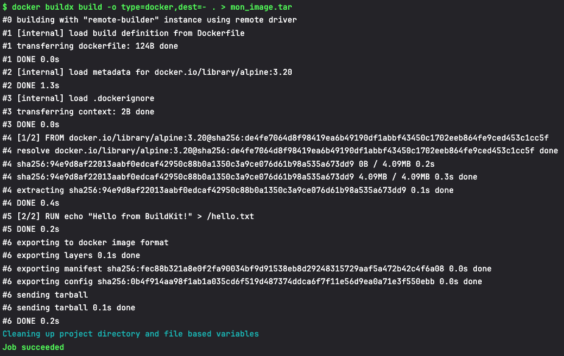

## Introduction
Quand on veut construire des images Docker dans un environnement Kubernetes, plusieurs solutions s'offrent à nous. Mais toutes ne se valent pas. Ce cours va te guider à travers trois grandes étapes :

D’abord, on va comparer les outils les plus courants pour construire des images : Docker-in-Docker, Kaniko, et Buildx/BuildKit.

Ensuite, tu verras comment déployer une infrastructure BuildKit sur Kubernetes, capable de monter en charge.

Et enfin, on terminera par une mise en pratique avec une pipeline GitLab qui utilise ce cluster de build pour générer une image.

## Les outils de build : quelles différences, quels choix ?
Quand tu construis une image Docker dans un cluster, tu ne peux pas juste lancer un docker build comme en local. Il faut un environnement d’exécution qui supporte ça. Voici les trois grandes approches.

### Docker-in-Docker : la méthode "à l'ancienne"
Docker-in-Docker, ou DinD pour les intimes, consiste à démarrer un conteneur… dans lequel tourne le démon Docker lui-même. C’est comme si tu miniaturisais ton environnement Docker classique à l’intérieur d’un pod Kubernetes.

C’est simple à mettre en place, et ça fonctionne bien avec les outils Docker traditionnels. Mais ce n’est pas sans contrepartie. Pour fonctionner correctement, DinD a souvent besoin du mode --privileged, ce qui pose de gros problèmes de sécurité. Et dans un cluster, ce genre de contournement peut rapidement devenir instable. Bref, ça dépanne, mais on évite en production.

### Kaniko : la solution cloud-native
Kaniko a été créé par Google pour contourner les limites de DinD. L’idée est élégante : on construit une image Docker sans démon Docker, en lisant et en interprétant le Dockerfile directement.

C’est très séduisant, surtout dans un monde Kubernetes, car c’est sécurisé, simple à déployer et conçu pour fonctionner dans des environnements sans privilèges. Mais Kaniko a aussi ses limites : les performances ne sont pas folles, et le support de certaines fonctionnalités avancées de Dockerfile est incomplet.

### BuildKit + Buildx : la version moderne et puissante
Et puis, il y a BuildKit. C’est l’outil de build Docker nouvelle génération, développé par les créateurs de Docker. Il est pensé pour la performance, le parallélisme, et la construction distribuée. Buildx, c’est l’outil en ligne de commande qui permet de piloter BuildKit comme un chef.

Avec BuildKit, tu peux compiler pour plusieurs architectures, bénéficier du cache entre les builds, et connecter des workers sur différents nœuds. Bref, c’est rapide, moderne, et ultra flexible.

Alors pourquoi ne l’utilise-t-on pas partout ? Tout simplement parce qu’il demande un peu plus d’infrastructure. Il faut installer et configurer un pool de builders dans ton cluster.

## Déployer un cluster BuildKit sur Kubernetes (avec scaling)
Bon, maintenant qu’on a choisi notre arme (spoiler : c’est BuildKit), voyons comment mettre tout ça en place dans un cluster Kubernetes.

Une infrastructure à base de pods buildkitd
Le cœur de l’architecture, c’est un déploiement de pods qui exécutent le démon buildkitd. Chaque pod écoute sur un port gRPC et peut accepter des requêtes de build. Tu peux les exposer via un service Kubernetes classique (LoadBalancer, ClusterIP, etc.).

Tu peux démarrer avec 2 ou 3 pods, puis monter progressivement si besoin. Et si tu veux que le cluster adapte automatiquement sa capacité à la charge, tu peux ajouter un autoscaler (HPA ou même KEDA pour de l’event-driven).

On commence par apply un deployment : 

```yaml
apiVersion: apps/v1
kind: Deployment
metadata:
  labels:
    app: buildkitd
  name: buildkitd
  namespace: gitlab
spec:
  replicas: 1
  selector:
    matchLabels:
      app: buildkitd
  template:
    metadata:
      labels:
        app: buildkitd
    # see buildkit/docs/rootless.md for caveats of rootless mode
    spec:
      containers:
        - name: buildkitd
          image: moby/buildkit:master-rootless
          args:
            - --addr
            - unix:///run/user/1000/buildkit/buildkitd.sock
            - --addr
            - tcp://0.0.0.0:1234
            - --oci-worker-no-process-sandbox
          # the probe below will only work after Release v0.6.3
          readinessProbe:
            exec:
              command:
                - buildctl
                - debug
                - workers
            initialDelaySeconds: 5
            periodSeconds: 30
          # the probe below will only work after Release v0.6.3
          livenessProbe:
            exec:
              command:
                - buildctl
                - debug
                - workers
            initialDelaySeconds: 5
            periodSeconds: 30
          securityContext:
            # Needs Kubernetes >= 1.19
            seccompProfile:
              type: Unconfined
            # Needs Kubernetes >= 1.30
            appArmorProfile:
              type: Unconfined
            # To change UID/GID, you need to rebuild the image
            runAsUser: 1000
            runAsGroup: 1000
          ports:
            - containerPort: 1234
          volumeMounts:
            # Dockerfile has `VOLUME /home/user/.local/share/buildkit` by default too,
            # but the default VOLUME does not work with rootless on Google's Container-Optimized OS
            # as it is mounted with `nosuid,nodev`.
            # https://github.com/moby/buildkit/issues/879#issuecomment-1240347038
            - mountPath: /home/user/.local/share/buildkit
              name: buildkitd
      volumes:
        - name: buildkitd
          emptyDir: {}
```

Puis on apply son service associé pour être accesible : 

```yaml
apiVersion: v1
kind: Service
metadata:
  labels:
    app: buildkitd
  name: buildkitd
  namespace: gitlab
spec:
  ports:
    - port: 1234
      protocol: TCP
      targetPort: 1234
  selector:
    app: buildkitd
```

!!! note
    Tu as des versions pour le lancer sur un simple pod, sous forme de job... Tout les exemples disponible [ici](https://github.com/moby/buildkit)

## Intégrer BuildKit à GitLab CI : une pipeline simple et efficace
Maintenant, place à la pratique. Imaginons que tu veux builder une image Docker simple depuis un job GitLab, mais au lieu d’utiliser DinD ou Kaniko, tu veux utiliser ton pool BuildKit sur Kubernetes.

On commence par se créer un Dockerfile des plus minimal : 
```dockerfile
FROM alpine:3.20
RUN echo "Hello from BuildKit!" > /hello.txt
CMD ["cat", "/hello.txt"]
```

Je te met ensuite la configuration Gitlab qui contacte notre pod de `BuildKit`, via la cli `buildx`, pour un simple `docker build`.

```yaml
stages:
  - build

variables:
  BUILDKIT_HOST: tcp://buildkitd.gitlab.svc.cluster.local:1234
  DOCKER_TLS_CERTDIR: ""

build_image:
  stage: build
  before_script:
    - apk add --no-cache curl bash git docker-cli docker-cli-buildx docker-rootless-extras
  script:
    - docker context create buildkit --docker "host=$BUILDKIT_HOST"
    - docker context use buildkit
    - docker buildx create --name remote-builder --platform=linux/arm64 --driver remote --use --bootstrap
    - docker buildx build -o type=docker,dest=- . > mon_image.tar
```

J'utilise ici une version rootless bien évidement, mais sans certificat, d'ou la présence de la variable `DOCKER_TLS_CERTDIR`, pour un gain de temps pour mon installation en local.

!!! tip
    La cli Buildx contient un max d'argument super intéressant, je met vraiment ici un exemple de buil le plus minimaliste possible.



## Conclusion
BuildKit, c’est vraiment la solution la plus moderne et scalable pour construire des images Docker dans un environnement Kubernetes. Couplé à GitLab CI par exemple, il te permet de sortir des vieilles pratiques risquées (comme DinD), tout en profitant de performances et de flexibilité inégalées, de build en multi-stage, etc.

Et en prime, tu peux scaler ton infra BuildKit automatiquement via HPA, pour que ton cluster soit prêt à répondre aux pics de builds... sans jamais trop consommer en temps normal.

