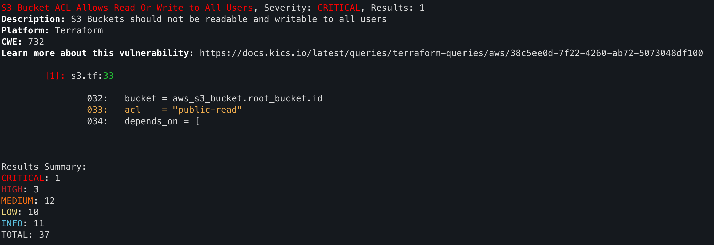

## Introduction 

KICS (Keeping Infrastructure as Code Secure) est un outil open source développé par Checkmarx, conçu pour détecter les vulnérabilités de sécurité, les problèmes de conformité et les erreurs de configuration dans les fichiers d'infrastructure as code (IaC) dès les premières étapes du cycle de développement. 

## Utilisation 
Une fois installé, KICS peut être exécuté en ligne de commande pour analyser vos fichiers IaC. Par exemple, pour analyser un fichier Terraform, vous pouvez utiliser la commande suivante :

```bash
kics scan -p <votre_folder_a_scan>
```

KICS génère ensuite un rapport détaillant les vulnérabilités et les erreurs de configuration détectées, facilitant ainsi leur correction avant le déploiement.


*Vous pouvez voir ici qu'un de mes bucket S3 est accessible en read sur le net* 