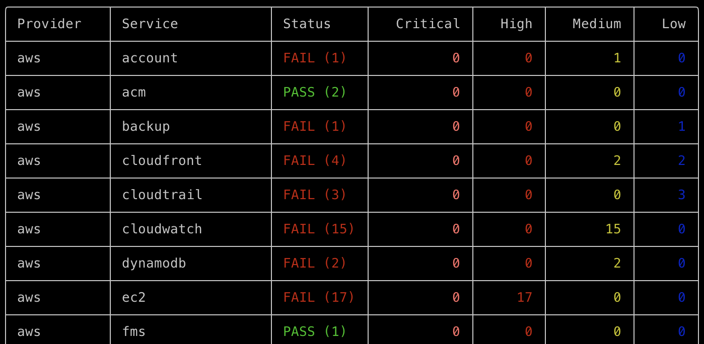
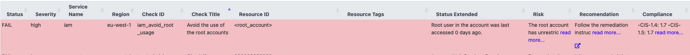

## Introduction
Prowler est un outil open-source de sécurité cloud conçu pour évaluer les bonnes pratiques, effectuer des audits, répondre aux incidents et assurer une surveillance continue sur des plateformes telles qu'AWS, Azure, Google Cloud et Kubernetes. 



*example sur mon compte AWS qui fait tourner mon site web, sur l'ensemble des compliances à vérifier*


*ici on voit en détails l'utilisation de l'user root, qui est clairement une mauvaise façon*

## Interface Web de Prowler

Prowler propose également une application web offrant une interface conviviale pour configurer et exécuter des analyses, visualiser les résultats et gérer vos découvertes de sécurité.

Après avoir installé l'application via votre outil préféré, lancez `prowler dashboard` pour accédez à l'interface en ouvrant votre navigateur à l'adresse suivante :
`http://localhost:3000`

## Utilisation

Pour effectuer une évaluation sur AWS, utilisez :
```bash
rowler aws
```

Pour Azure :
```bash
prowler azure
```

Pour Google Cloud :
```bash
prowler gcp
```

Pour Kubernetes :
```bash
prowler kubernetes
```