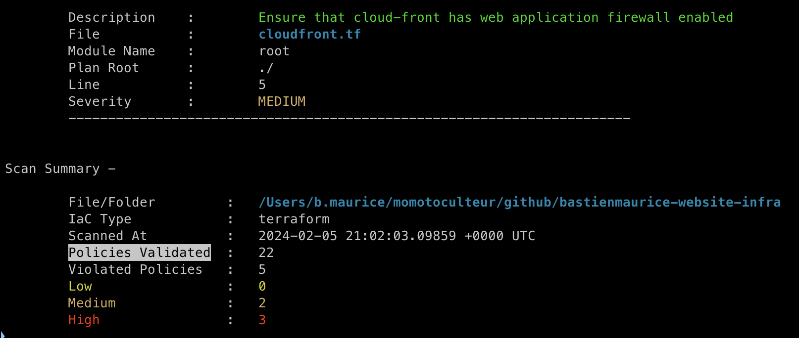

Terrascan est un outil open-source d'analyse statique de code conçu pour examiner les configurations d'Infrastructure as Code (IaC). Il aide à identifier les vulnérabilités de sécurité, les violations de conformité et les écarts par rapport aux meilleures pratiques dans le code IaC.  

Terrascan prend en charge divers frameworks IaC, notamment Terraform, Kubernetes et Helm, et peut être intégré dans des pipelines CI/CD pour une surveillance continue. 

## Fonctionnalités principales de Terrascan

- **Support multi-cloud** : Terrascan est compatible avec plusieurs cloud providers, tels qu'AWS, Azure et Google Cloud Platform, ce qui le rend polyvalent pour les déploiements multi-cloud. 

- **Analyse de code Terraform** : Terrascan peut analyser des configurations Terraform pour détecter des violations de politiques, comme l'absence de verrous de ressources ou des configurations de sécurité inadéquates. 

- **Analyse de chartes Helm** : Il peut être utilisé pour analyser des chartes Helm et identifier des problèmes de sécurité, tels que des configurations de conteneurs non sécurisées. 

- **Analyse de manifestes Kubernetes** : Terrascan peut examiner des manifestes Kubernetes pour s'assurer que les meilleures pratiques de sécurité sont respectées, comme l'évitement de l'exécution de conteneurs avec des privilèges élevés. 

- **Intégration CI/CD** : Terrascan peut être intégré dans des pipelines CI/CD, des environnements de développement intégrés (IDE) et d'autres flux de travail de développement et de déploiement, permettant une analyse automatisée du code IaC. 


## Utilisation de Terrascan - Local

Après l'installation, pour analyser votre code IaC, naviguez vers le répertoire contenant vos fichiers de configuration et exécutez :

```bash
terrascan scan
```

La première fois que vous utilisez Terrascan, si le flag `-p` n'est pas spécifié, il téléchargera les dernières politiques depuis le référentiel Terrascan. Vous pouvez mettre à jour votre environnement local avec les dernières politiques en exécutant `terrascan init`. 

## Utilisation de Terrascan - GitlabCI

Exemple de code en CI/CD :

```yaml linenums="1"
terrascan-terraform-iac:
    stage: sast
    image: 
        name:  tenable/terrascan:1.18.11
        entrypoint: [""]
    script:
        - terrascan scan
```




**Création de politiques personnalisées :**

Terrascan utilise le moteur Open Policy Agent (OPA), permettant de créer des politiques personnalisées en utilisant le langage de requête Rego. Les politiques personnalisées peuvent être définies dans des fichiers `.rego`, avec des fichiers de configuration JSON associés pour spécifier leur application et leur niveau de sévérité. 

**Comparaison avec d'autres outils :**

- **Terrascan vs Checkov** : Les deux sont des outils d'analyse statique open-source pour l'IaC. Checkov se concentre davantage sur Terraform mais peut analyser plusieurs types de fichiers, y compris CloudFormation et Kubernetes. Checkov est construit en Python, tandis que Terrascan utilise Go et des politiques écrites en Rego. 

- **Terrascan vs TFSec** : TFSec est un autre outil d'analyse statique open-source, écrit en Go, utilisant des définitions de politiques en YAML. Les utilisateurs familiers avec Kubernetes peuvent préférer écrire des politiques en YAML avec TFSec plutôt qu'apprendre Rego avec Terrascan. 

En résumé, Terrascan est un outil puissant pour assurer que votre infrastructure en tant que code est sécurisée et conforme aux normes, en détectant les problèmes potentiels avant le déploiement de l'infrastructure.

 