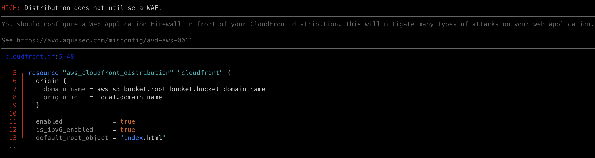

Trivy est un outil open-source développé par Aqua Security, conçu pour analyser les vulnérabilités et les mauvaises configurations dans divers artefacts, y compris les configurations d'Infrastructure as Code (IaC).  

Depuis l'intégration de **tfsec**, Trivy offre des capacités étendues pour l'analyse de configurations IaC, notamment pour Terraform.

## Fonctionnalités principales

- **Détection automatique des types de configuration** : Trivy identifie automatiquement les types de fichiers IaC présents dans un répertoire et applique les politiques pertinentes en conséquence. 

- **Large couverture de politiques** : Grâce à l'intégration de tfsec, Trivy dispose d'une vaste bibliothèque de règles de sécurité pour détecter les mauvaises configurations dans les fichiers Terraform. 

- **Intégration CI/CD** : Trivy peut être facilement intégré dans les pipelines CI/CD, permettant une analyse continue des configurations IaC pour assurer la conformité et la sécurité avant le déploiement.


## Utilisation de Trivy - Local

Après l'installation, pour analyser un répertoire contenant des fichiers Terraform, exécutez la commande suivante :

```bash
trivy config <chemin/vers/le/répertoire>
```

Trivy analysera les fichiers de configuration et fournira un rapport détaillé des mauvaises configurations détectées, avec des indications sur leur gravité et des recommandations pour les corriger.

## Utilisation de Trivy - GitlabCI

Exemple de code en CI/CD :

```yaml linenums="1"
trivy-terraform-iac:
    stage: sast
    image: 
        name:  hashicorp/terraform:1.7.2
        entrypoint: [""]
    script:
        - trivy config .
```

Example de déclaration d'un CDN qui n'utilise pas de Web Application Firewall (WAF):




En résumé, Trivy est un outil puissant et polyvalent pour l'analyse des configurations d'Infrastructure as Code, offrant des fonctionnalités avancées pour détecter et corriger les mauvaises configurations, assurant ainsi la sécurité et la conformité de votre infrastructure avant son déploiement. 

