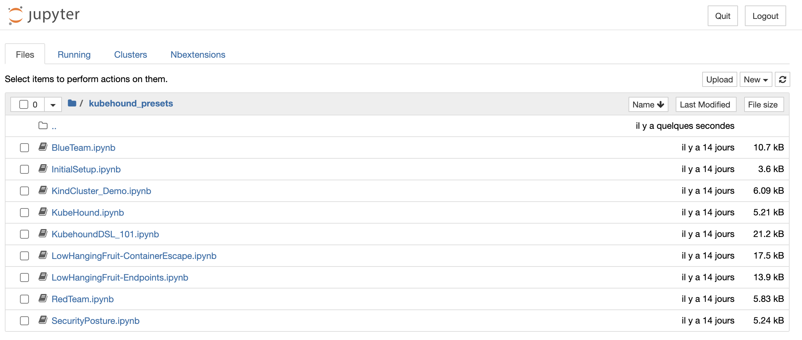
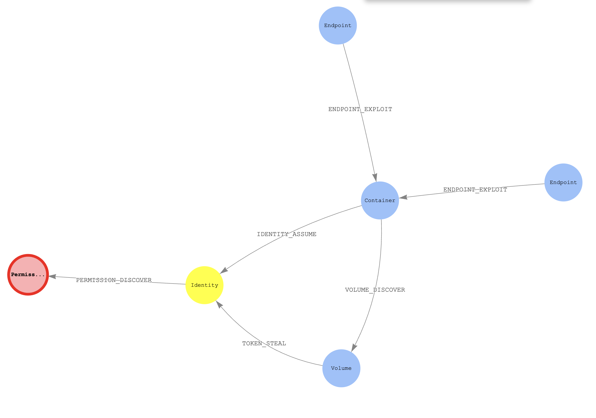

KubeHound est un outil conçu pour analyser la sécurité des clusters Kubernetes en identifiant les chemins d'attaque possibles. Il génère un graphe des chemins d'attaque au sein d'un cluster, permettant de visualiser et de comprendre comment un attaquant pourrait exploiter des vulnérabilités pour accéder à des ressources sensibles. 

## Fonctionnalités principales 

- **Identification des attaques** : KubeHound peut détecter plus de 25 types d'attaques, allant des évasions de conteneurs aux mouvements latéraux. 

- **Analyse des chemins d'attaque** : Il permet de déterminer des questions complexes telles que :  
    - Quels sont les chemins exploitables les plus courts entre un service exposé publiquement et un rôle d'administrateur du cluster ?
    - Existe-t-il un chemin d'attaque d'un conteneur spécifique vers un nœud du cluster ? 

- **Efficacité** : Conçu pour gérer de grands clusters, KubeHound peut ingérer et analyser les données en quelques secondes pour un cluster de 1 000 pods, et en quelques minutes pour des clusters plus importants. 

## Gremlin Query Language
Pour intéroger notre base de données **JanusGraph** afin d'en créer des dashboards, Kubehound utilise une version maison du language [Gremlin Query Language](https://tinkerpop.apache.org/gremlin.html)

## Utilisation de KubeHound en Local
### Installation

1. Prérequis 
    - Docker version 19.03 ou supérieure.
    - Docker Compose version 2.0 ou supérieure. 

2. Installation
    - Téléchargez le binaire approprié pour votre plateforme :
     ```bash
     wget https://github.com/DataDog/KubeHound/releases/latest/download/kubehound-$(uname -o | sed 's/GNU\///g')-$(uname -m) -O kubehound
     chmod +x kubehound
     ```
!!! tip
    Simplifie toi la vie avec les package manager comme Choco ou Brew

### Lancer une analyse
- Configuration du contexte Kubernetes
    - Assurez-vous que votre contexte `kubectl` pointe vers le cluster cible :
     ```bash
     kubectl config current-context
     kubectl config set-context <nom_du_contexte>
     ```

2. Exécution de KubeHound
    - Lancez KubeHound avec la configuration par défaut :
     ```bash
     ./kubehound
     ```

3. Accès aux données
    - KubeHound fournit une interface utilisateur via des notebooks Jupyter.
    - Accédez à l'interface à l'adresse `http://localhost:8888` avec le mot de passe par défaut `admin`. 


 

L'équipe qui développe ce tool te laisse à disposition des jupyter notebook pour te faire une rapide itération. Mais libre à toi de faire tes propres dashboard :)

- Visualisation et requêtes
    - Utilisez le notebook pour exécuter des requêtes et visualiser le graphe des chemins d'attaque.
    - KubeHound utilise le langage de requête Gremlin pour interroger les données. 

## Exemple d'une analyse
Je te montre ici sur un dashboard fourni par défaut une analyse que j'ai lancer sur un cluster Kube local, via un k3s (rancher-desktop)




Ici te montrer une potentiel accès de priviléges qu'un attaquand peut potentiellement obtenir. Le but ici n'est pas d'avoir aucun node rouge, mais de les limiter et controller.

1. Accès provenant de l'extérieur via un **endpoint** exposé de mon container grace à un **Service**
2. Accès au **container** qui éxecute du code
3. Assumer une **identity** en dérobant un **token** qui est stocké sur le **Volume** utilisé par le container
4. Obtenir la liste des **permissions** accordés au container afin de trouver une faille dans celles-ci.