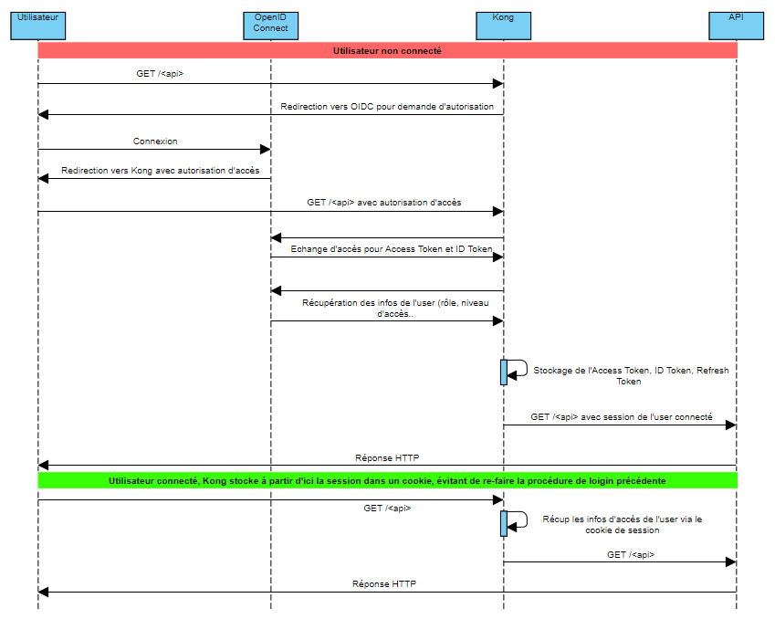
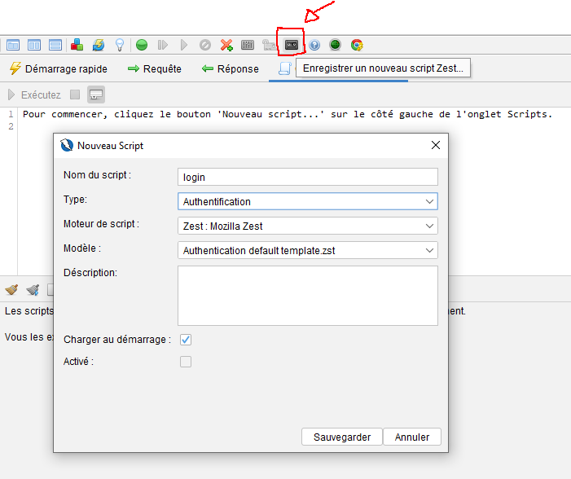
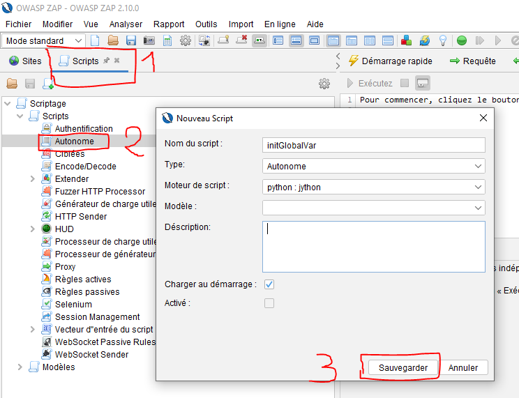
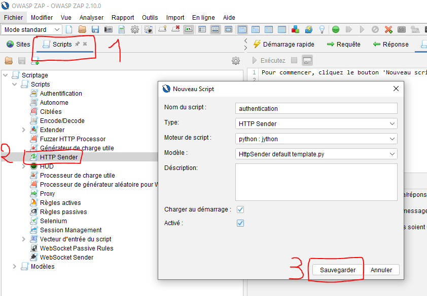
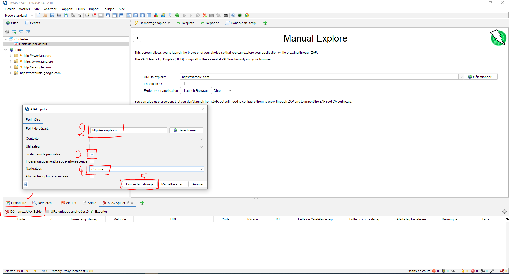
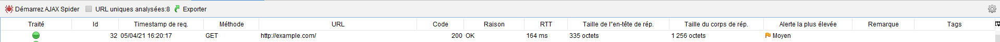

L'ensemble du code source est disponible sur mon [Github](https://github.com/Momotoculteur/DAST-owasp-zap-authentication-httpsender-oidc-oauth-kong)  😁

## Un peu de théorie... 📚

On utilise de nos jours beaucoup de données, au seins de diverses applications, qui elles-mêmes peuvent s'échanger des données sur de multiples plateformes, accessible depuis une multitude d'appareils.

Quid de la sécurité pour éviter toute utilisation abusive ou frauduleuse ?

 
### Protocole

#### OAuth

C'est un protocole permettant une autorisation à 'consommer' une API sécurisée. On peut alors interagir avec une application via une autorisation accordé par ce protocole sans avoir à partager son username ou mot de passe en clair.
 
#### OpenID Connect

C'est une surcouche à OAuth. Autant ce dernier et un protocole  d'autorisation de ressources, OIDC est un protocole d'identification, permettant de vérifier l'identité d'un utilisateur en se basant sur l'authentification fourni par un serveur d'autorisation.

#### Kong

Celui-ci est le serveur d'autorisation précédemment évoqué.


### Logiciel

#### OWASP ZAP

Logiciel gratuit et open source, c'est l'outils de pentest le plus connue. Il n'as pas pour but de vous faire remonter la dernière faille zéro day du jour, mais plutôt de tester des mécanismes d'intrusions standard dont les plus connus.

Mais pourquoi un tuto? Car pour permettre de tester votre application dans sa globalité, et afin d'accéder à l'ensemble des pages et sous pages, vous allez devoir manipuler ZAP pour lui indiquer comment s'authentifier comme un vrai utilisateur. Vous ne parcourrez que partiellement votre appli web dans le cas contraire.

### Authentification: form-based script

Vous allez avoir des scripts déjà fait au sein même de ZAP pour le cas d'application simple, tel que des sites wordpress. En effet, vous avez une URL statique, des credentials à envoyé dans une requête et ça fonctionne. Ce sont des **form-based script**.


### Authentification: authentication-based script

Un autre type, appelé **authentification-based script**, peuvent ajouter des éléments pour des connexion à des sites plus complexe. Par exemple, si vous devez injecter en requête HTTP POST un token anti-CRSF. Il ajoute une sécurité en plus à votre site web, il est généré en général via des éléments renvoyé par le serveur (state, nonce, etc.). Cela permet d'éviter des attaques de type CRSF ( cross-site request forgery) qui consiste à transmettre à un user connecté une requête HTTP falsifié, résultant en une exécution d'une action sans être au courant ou l'initiateur, mais via ses propres droits. L'user est donc complice de l'attaque sans même sans rendre compte.

 
### Authentification: HTTP-sender script

C'est celui-ci dont on va utiliser pour ce tuto. Ce script est appelé automatiquement lors de chaque requête que va envoyer ou recevoir ZAP vers votre application web. Mais pourquoi le script précédent ne peut-il pas correspondre ?

Voici un diagramme de séquence entre vos divers autorités :



 

Vous allez donc avoir une multitude d'échange (rendant impossible le login avec un script menant vers une page statique, au vu de nos multitude redirections on va manger un timeout), permettant de générer des variables aléatoires (state, nonce, crsf token, etc.). Avec celles-ci vous allez pouvoir vous loger dans votre application web, et enfin recevoir un cookie de session ou un JWT. C'est l'un des deux selon votre appli web, qui sera consommé par celle-ci afin de vérifier votre authenticité. Nous ne pouvons récupérer l'ensemble de ces champs avec l'un des type de script dont nous avons parlé précédent, et qui sont essentiel.

Le script HTTPSender interceptant chaque requête, on va pouvoir lui injecter en header HTTP GET ce cookie de session/JWT que l'on va stocker en variable globale, permettant de maintenir notre utilisateur connecté et permettant de parser l'appli web dans son intégralité.

 

Nous savons maintenant comment injecter ces tokens. Cependant, je n'ai parlé de comment le générer, avant de pouvoir l'envoyer des nos requêtes. Nous allons devoir utiliser une approche hybride selon la complexité de vos application web, avec d'une part du **selenium/webdriver** afin de remplir les champs comme bon nous semble, ne nous loger, et de récupérer les cookies et autre token que nous souhaitons. Vous pourrez toujours faire des appels supplémentaires GET ou POST si votre application nécessite d'avantage de complexité.

 

Si on doit résumer la procédure :

1. Approche hybride selenium/webdriver pour bypass les xxx redirections vers la bonne page de login, avec l'ensemble des state/nonce généré aléatoirement qui sont nécéssaire
2. Remplir la page de login avec nos credentials et valider
3. Extraire le cookie de session ou JWT (bearer token) en variable globale
4. Injecter ce cookie/JWT en header de requête pour tout HTTP GET via notre HTTPSender script afin d'être authentifié

 

## Beaucoup de pratique 😁

Avant de vous lancer directement dans l'automatisation de vos tâches pour une CI/CD par exemple, dans un environnement sans UI, veillez à connaître dans les moindres détails l'ensemble des échanges qui s'effectue entre votre divers protocoles, car vous allez devoir scripter chaque requête à la main afin de reproduire une connexion à vos ressources comme si celle-ci était faîte depuis un navigateur. Cela va aller de la connexion sur le site avec vos credentials, avec la récupération de divers éléments (state, nonce, crsf token, etc.) afin de pouvoir en générer d'autres permettant de prouver votre identité ( divers cookie, token, etc.)

Afin de faciliter la tâche, je vous conseil de débuter de scripter la partie authentification à votre site web via l'application desktop dans un premier temps. Vous pourrez ainsi voir les divers échanges entre vos protocole, si vous ne connaissez pas la procédure dans sa globalité.

 

### OWASP ZAP en mode desktop

Je vais détailler d'avantage le contenu des scripts dans la partie suivante, et me consacrer dans celle-ci principalement à vous présenter l'application desktop Zap.

 

#### Moteur de scripting

Zap est écrit en Java. Mais nous pouvons écrire nos scripts dans d'autres langages via des moteurs de scripts :

- Javascript via Graal.js ou Oracle Nashorn
- Zest via Mozilla
- Python via Jython

J'aime bien le python, donc la suite du tuto sera utilisé avec Jython.

Python et javascript vous permettent d'écrire tout à la main vos scripts. Cependant, Zest vous permet d'enregistrer automatiquement toute action que vous faîtes sur votre appli web, lorsque vous la scanné en mode manuel. Vous pouvez ainsi vous décharger de la tâche pénible de scripter chaque action nécessaire pour être authentifier au sein de votre application, et juste naviguer en mode manuel via Zap sur votre application. Zest va s'occuper d'enregistrer chaque étape dans un format ressemblant à du JSON. Gain de temps assuré ! 😎

{ loading=lazy } 
///caption
Enregistrement de la séquence d'authentification via le moteur de script Zest (Mozilla)
///

#### Scripting - Standalone script

{ loading=lazy } 
///caption
Création d'un script autonome (standalone)
///

#### Scripting - HTTPSender script

{ loading=lazy } 
///caption
Création d'un HTTPSender script
///

#### Test de l'authentification

Une fois que vos deux scripts sont crée on va pouvoir tester notre solution. Par exemple pour un scan actif.

Commencez par clique-droit sur votre script standalone, et exécutez le afin de reset le contenu de notre cookie. A faire entre chaque parcours manuel de votre application, sinon vous risquez de vous prendre un time out si votre cookie se refresh à chaque session.

Ensuite clique-droit sur votre script http-sender afin de l'activer.

Vous pouvez maintenant lancer votre scan actif et vérifier que le spider récupère bien des pages avec un code de retour OK (200). Choisissez votre point de départ et lancez le balayage :

{ loading=lazy }

 

On peut voir que le scan se passe comme souhaité. Vérifiez qu'il passe bien dans vos sous-domaines réservés aux utilisateurs authentifié.

{ loading=lazy }

### OWASP ZAP en mode automatique/headless

#### Scripting - Standalone script

On commence par écrire notre premier script qui nous permet d'initialiser une seule et unique fois notre variable globale du cookie à null :

```python linenums="1" title="clear.py"
import org.zaproxy.zap.extension.script.ScriptVars as GlobalVariables

GlobalVariables.setGlobalCustomVar("COOKIE", None)
```

#### Scripting - HTTPSender script

La partie la plus importante du projet consiste à écrire notre script qui va à la fois nous permettre de nous connecter, de récupérer notre objet nous permettant de nous authentifier, pour enfin l'envoyer dans chaque requête qui passe par Zap.

On commence donc par divers imports de bibliothèque dont on va avoir besoin. Ne vous affolez pas à voir des imports de lib Java dans le script Python !

On y défini quelques variables globales, dont la page de connexion initiale à notre app web :

```python linenums="1" title="login.py"
import java.net.HttpCookie as HttpCookie
import org.openqa.selenium.By as By
from synchronize import make_synchronized
import org.openqa.selenium.firefox.FirefoxDriver as FirefoxDriver
import org.openqa.selenium.firefox.FirefoxOptions as FirefoxOptions
import org.openqa.selenium.support.ui.WebDriverWait as WebDriverWait
import org.openqa.selenium.support.ui.ExpectedConditions as ExpectedConditions
import org.zaproxy.zap.extension.script.ScriptVars as GlobalVariables


# GLOBAL VARIABLES
COOKIE_NAME = "session"
URL_LOGIN = "https://monsite.fr/login"
COOKIE = "COOKIE"
```

Lorsque vous créez un script HTTPSender avec le squelette de base, vous allez avoir ces deux fonctions de base :

- sendingRequest : appelé à chaque envoie de requête à travers Zap vers notre app
- ResponseReceived : appelé à chaque réponse de notre app vers Zap.

Nous n'utiliserons que la première, car nous souhaitons simplement modifier notre en-tête de requête afin d'ajouter un élément qui nous permette de prouver que l'on est un utilisateur authentifié.

La fonction est simple. On vérifie que notre cookie existe. Si c'est le cas, on l'injecte simplement à notre requête via une fonction défini plus tard. Dans le cas contraire, on va récupérer ce cookie d'abords.


```python linenums="1" title="login.py"
def sendingRequest(msg, initiator, helper):
    '''
    Appelé a chaque requête, lors d'en envoi
    '''

    print('sendingRequest called for url=' +
          msg.getRequestHeader().getURI().toString())

    cookieInCurrentSession = GlobalVariables.getGlobalCustomVar(COOKIE)

    if cookieInCurrentSession is None:
        login(helper)

    setCookieInRequest(msg)


def responseReceived(msg, initiator, helper):
    '''
    Appelé a chaque requête, lors des réponses
    Non utile pour le cadre de notre cours
    '''

    print('responseReceived called for url=' +
          msg.getRequestHeader().getURI().toString())
```

Cette fonction est très généraliste, vous devrez l'adapter en fonction de l'ensemble des étapes nécessaires concernant votre type d'authentification. Chaque site étant différent, je ne peux vous la faire dans sa globalité. Mais le schéma global est le suivant :

- Créer une fenêtre Firefox. Vous pouvez lui spécifier des arguments, par exemple **\--headless** qui doit être obligatoire si vous tournez sous une CI/CD par exemple. Si vous êtes sur un environnement windows, vous devrez rajouter le **\--disable-gpu** ( qui est une issue connue sur le github de Zap), ou encore ajouter **\--disable-extensions** pour gagner en performance. Si vous avez un proxy d'entreprise par exemple, vous pourrez aussi lui passer.
- Ouvrir Firefox sur votre page de login. Selon votre provider d'autorisation, vous allez avoir plusieurs redirections. J'ai rajouté une condition afin d'être certains d'être sur la bonne page de login à l'arrivée.
- Remplir les champs pour s'authentifier via Selenium. Je vous ait mis quelques exemple pour trouver vos champs, et les remplir.
- Une fois connecté et arrivé sur notre page final pour un utilisateur authentifié, je récupère mon cookie pour l'injecter dans ma variable global. Dans mon cas je récupère un cookie dont le nom est **"session"**, ainsi que sa valeur.

```python linenums="1" title="login.py"
def login(helper):
    '''
    Fonction permettant se récupérer le cookie de session après une connexion via selenium
    '''
    
    firefoxOptions = FirefoxOptions()
    #firefoxOptions.addArguments("--window-size=1920,1080")
    #firefoxOptions.addArguments("--disable-gpu")
    #firefoxOptions.addArguments("--disable-extensions")
    #firefoxOptions.addArguments("--proxy-server='direct://'")
    #firefoxOptions.addArguments("--proxy-bypass-list=*")
    #firefoxOptions.addArguments("--start-maximized")
    firefoxOptions.addArguments("--headless")
    webDriver = FirefoxDriver(firefoxOptions)

    webDriver.get(URL_LOGIN)

    timeOut = 3
    waiter = WebDriverWait(webDriver, timeOut)

    waiter.until(ExpectedConditions.visibilityOfElement(By.id("login-form")))
    webDriver.findElement(By.name("email")).sendKeys("bastien@hotmail.com")
    webDriver.findElement(By.name("pass")).sendKeys("123")
    webDriver.findElement(By.name("login-button")).click()

    waiter.until(ExpectedConditions.visibilityOfElement(By.id("welcome-page")))

    GlobalVariables.setGlobalCustomVar(COOKIE, 
                                        str(webDriver.manage().getCookieNamed(COOKIE_NAME).getValue()))
```

On peut enfin dans une dernière fonction injecter notre cookie de session dans l'entête de l'ensemble de nos requêtes qui transitent par Zap, nous permettant de maintenir notre authentification durant tout le processus de scan :

 ```python linenums="1" title="login.py"
def setCookieInRequest(msg):
    '''
    Injection du cookie de session stocké en var global dans chaque requête
    '''

    msg.getRequestHeader().setCookies([GlobalVariables.getGlobalCustomVar(COOKIE)])
```

Dans le cas ou vous souhaitez envoyer un Json Web Token (JWT ou appelé Bearer Token) c'est quasiment la même chose :

```python linenums="1" title="clear.py"
def setBearerInRequest(msg):
    '''
    Injection Json Web Token(bearer) de session stocké en var global dans chaque requête
    '''
    
    msg.getRequestHeader().setHeader("Authorization", "Bearer " + GlobalVariables.getGlobalCustomVar(ACCESS_TOKEN));
```

Dans ce cas là, n'oubliez pas de sauvegarder en variable globale dans la fonction **login()**, votre token d'accès ainsi que votre token d'expiration. Dans le cas que votre token ne dure pas une session complète mais pour un temps limité, vous devrez ajouter dans la méthode **login()** une étape permettant de vérifier que votre jeton est encore valide. Dans le cas contraire, il faudra repasser par l'étape **login()** afin de demander de renouveler votre jeton.

C'est fait de tête rapidos, mais le principe est là si vous souhaitez implémenter une vérification de token concernant sa date de validité et d'expiration :

```python linenums="1" title="login.py"
import time 

def sendingRequest(msg, initiator, helper):
    accessToken = GlobalVariables.getGlobalCustomVar(ACCESS_TOKEN)

    # Token KO ou expiré
    if accessToken is None or tokenHasExpired():
        login()
        
    #Token OK
    setTokenInRequest(msg)
    
    
def tokenHasExpired(accessToken):
    accessTokenCreation = GlobalVariables.getGlobalCustomVar(ACCESS_TOKEN_CREATION);

    currentTime = time.time();
    difference = currentTime - accessTokenCreation;

    accessTokenExpiryInSeconds = GlobalVariables.getGlobalCustomVar(ACCESS_TOKEN_EXPIRY);
    if difference > accessTokenExpiryInSeconds:
        print "token expiré"
        return True;
    else:
      print "token OK"
      return False;
```
 

#### Lancement en CI/CD

On lance notre image depuis le répo officiel :

```bash linenums="1" title="terminal"
docker run -u zap -p 8080:8080 -it owasp/zap2docker-stable bash
```

Afin d'utiliser nos scripts, on doit les déplacer au sein même de notre image dans les dossiers correspondant : **/scripts** pour les scripts, et **/plugin** pour y mettre n'extension du moteur de script **Jython**. En effet il n'est pas disponible de base, il faut soit le rajouter à la main comme ceci, soit l'ajouter (indiqué dans la commande suivante) au lancement de Zap :


```bash linenums="1" title="terminal"
# Récupération de l'ID
docker container ls

# Copie des scripts dans notre container
docker cp xxx.py <container_id>:/zap/plugin

# Copie d'éventuels addons en local
docker cp xxx.py <container_id>:/zap/scripts
```

Nous n'avons plus qu'a lancer le script zap-x.sh (très important le -x afin de tourner dans un mode headless). J'autorise tout les IP à accéder à Zap en désactivant la clée API et en whitelistant via le **name** et **regex**. Vous pouvez ajouter des extensions ici à la volée, ou même mettre à jour ceux déjà présent :


```bash linenums="1" title="terminal"
./zap-x.sh main.py -host 0.0.0.0 -port 8080 -config api.disablekey=true -config api.addrs.addr.name=.\* -config api.addrs.addr.regex=true -addoninstall jython -addonupdate
```
 

#### Script global

Je fais référence à un script main.py dans ma dernière commande docker. En effet pas besoin dans ZAPDesktop, mais en version full-script, vous allez devoir avoir besoin d'un script que l'on peu qualifier de global, qui va discuter avec notre image de Zap lancé en mode daemon. Ce mode **daemon** va permettre à ZAP d'être à l'écoute de tout appel. Nous pourrons communiquer entre celui-ci et notre script main.py via l'api REST offerte.

Faîte vous un environnement virtuel Python, que ça soit Venv sur MAC OS ou Anaconda pour windows. On aura besoin de descendre une dépendance :

```bash linenums="1" title="terminal"
pip install python-owasp-zap-v2.4
```


Voici la manœuvre à suivre pour communiquer avec ZAP, et surtout comment charger, activer et lancer vos scripts afin de gérer toute l'étape d'authentification dans un environnement headless avant de lancer les spider pour crawl et de lancer les attaques via scanner :


```python linenums="1" title="main.py"
# Lancement de ZAP...
# Attente du lancement de Zap...
# Lancement d'une session...
# Création d'un nouveau contexte...
# Ajout des URL du contexte...
# Ajout des URL hors contexte...
# Choisir la gestion de session (sessionManagement) "cookieBasedSessionManagement" pour cookie, "httpAuthSessionManagement" pour JWT
zap.sessionManagement.set_session_management_method(
                contextid=contextId, methodname=sessionManagement,
                methodconfigparams=None))
# Zap en mode attaque...
# Chargement et lancement du script clearGlobalVariables.py
zap.script.load(scriptname='clearGlobalVariables.py', scripttype='standalone',
                scriptengine='jython',
                filename='./clearGlobalVariables.py',
                scriptdescription='Description du script'))
zap.script.run_stand_alone_script(scriptname='clearGlobalVariables.py')

# Chargement et activation du script doLogin.py
zap.script.load(scriptname='doLogin.py', scripttype='httpsender',
                scriptengine='jython',
                filename='./doLogin.py',
                scriptdescription='Description du script'))
zap.script.enable(scriptname='clearGlobalVariables.py')
# Authentification manuelle
zap.authentication.set_authentication_method(contextid=contextId,
                                           authmethodname='manualAuthentication',
                                           authmethodconfigparams=authParams))
# Scan passif via traditionnakl spider pour site en HTML
#   et via Ajax spider pour des applis avec beaucoup de javascript
# Scan actif
# Affichage des alertes de vulnérabilités trouvés
```
 
#### Requête générique

Si votre flux d'authentification est plus complexe, et que vous devez récupérer des champs comme le State, None, ou encore un CRSF Token, je vous met ci dessous de quoi réaliser des requêtes génériques GET et POST dans le scritpt HTTPSender :

```python linenums="1" title="login.py"
# Fonction générique pour faire une requête GET
def callGet(requestUrl, headers, helper):
    requestUri = URI(requestUrl, False);
    print "-----start of callGet-------";
    print "requestUrl:"+requestUrl;
    msg = HttpMessage();
    requestHeader = HttpRequestHeader(HttpRequestHeader.GET, requestUri, HttpHeader.HTTP10);
    msg.setRequestHeader(requestHeader);
 
    for name, value in headers.items():
        requestHeader.setHeader(name, value);
 
    print "Sending GET request: " + str(requestHeader);
 
    helper.getHttpSender().sendAndReceive(msg)
    print "Received response status code for authentication request: " + str(msg.getResponseHeader());
    print("\nResponseBody: " + str(msg.getResponseBody()));
    print "------------------------------------";
    return msg;

# Fonction générique pour faire une requête POST
def callPost(requestUrl, requestBody, headers, cookies, contentType, helper):
    print "-----start of callPost ("+requestUrl+")-------";
 
    requestUri = URI(requestUrl, False);
    msg = HttpMessage();
    requestHeader = HttpRequestHeader(HttpRequestHeader.POST, requestUri, HttpHeader.HTTP10);
    requestHeader.setHeader("content-type",contentType);
 
    for name, value in headers.items():
        requestHeader.setHeader(name, value);
 
    requestHeader.setCookies(cookies)
    msg.setRequestHeader(requestHeader);
    msg.setRequestBody(requestBody);
    print("Sending POST request header: " + str(requestHeader));
    print("Sending POST request body: " + str(requestBody));
    helper.getHttpSender().sendAndReceive(msg);
    print("\nReceived response status code for authentication request: " + str(msg.getResponseHeader()));
    print("\nResponseBody: " + str(msg.getResponseBody()));
    print("------------------------------------");
    return msg;
```
 