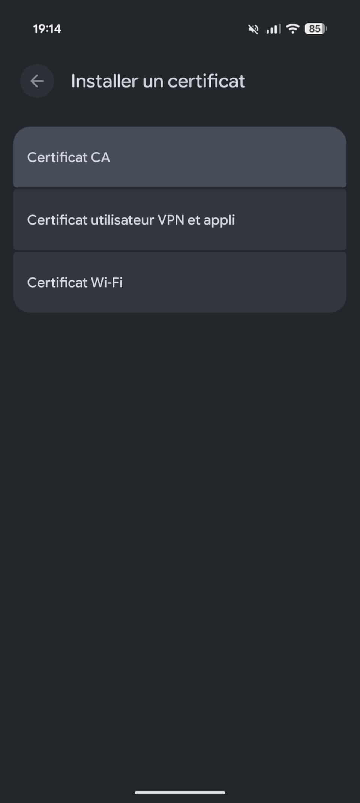
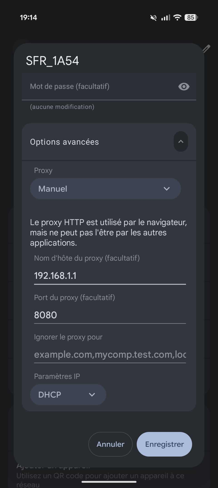
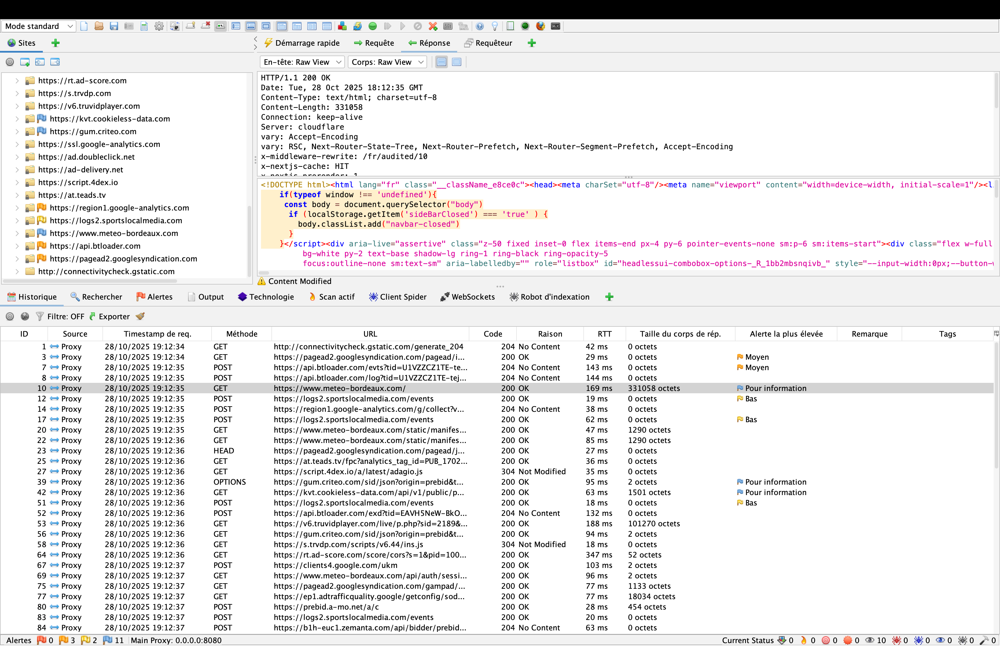

Le but, c’est de faire tourner OWASP ZAP sur ton ordi (ton laptop), et d’utiliser ton smartphone Android pour envoyer son trafic à travers ce proxy.
Résultat : tu vas pouvoir voir toutes les requêtes HTTP/HTTPS que ton téléphone envoie 🎯

## Pré-requis
- Ton laptop avec OWASP ZAP installé
- Ton smartphone Android
- Les deux connectés sur le même Wi-Fi (par ex. ta box)

## Mise en place de Zap
Installe OWASP Zap Desktop sur ton laptop.

On souhaite avoir notre proxy qui tourne sur le laptop, mais par défaut il écoute sur `127.0.0.1:8080`, adresse sur laquelle ton smartphone ne peut avoir accés.  

Modifie cette adresse ici : **Zap -> Outils -> Options -> Network -> Local Servers/Proxies**, et set l'adresse du **Main Proxy** à `0.0.0.0:8080`

!!! note
    Tu peux choisir le port que tu souhaites si tu utilises déjà le 8080 sur ton poste :)

## Mise en place de ton smartphone
### Installation du certificat
Génére un certificat avec Zap **Zap -> Outils -> Options -> Network -> Server Certificates** et sauvegarde le. Tu peux ensuite l'envoyer sur ton smartphone de la façon dont tu souhaite.

Sur ton smartphone, tu vas aller dans **Paramètres ->Sécurité et confidentialité renforcéees -> Chiffrement et identifiants -> Installer un certificat -> Certificat CA**. Choisis le fichier fraichement importé, et accepte. Ton smartphone va pouvoir valider les futures connections vers cette destination.

{.center width=40%}

### Mise en place du proxy
Tu devras avoir ton téléphone ainsi que ton laptop sur la même box internet.

Récupère l'adresse IP de ton laptop via `ipconfig getifaddr en0`

!!! info
    La commande varie selon ton OS, interface, etc. A toi de récupérer la bonne. Et attention on veut ton IP locale, **pas ton adresse IP publique** !!!

Dans la section Wifi de ton smartphone, tu vas devoir cliquer sur les paramètres du SSID de ta wifi maison, et dans les détails, cliquer sur modifier. Déroule le menu **Options avancées** pour y activer le proxy en mode **manuel**. 

Rentre y l'IP de ton laptop, ainsi que le port `8080`, et le paramètre IP en **DHCP**.

{.center width=40%}

Plus qu'à lancer ton browser préféré, et observer les packets transiter à travers Zap !!

