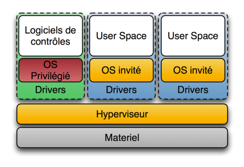
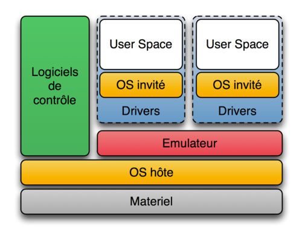
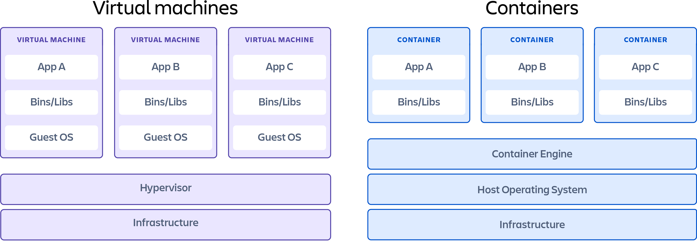

## Revenons un temps en arrière ... 

Comment déployer une application ?  
- Build pour un OS spécifique  
- Un serveur dédié par app  

Résulat ?  
- Manque de flexibilité pour deployer
- Manque d'optimisation des ressources 

---

# Virtualisation
<!-- .slide: data-background="#009485" -->
<!-- .slide: class="center" -->

---

## Virtualisation
Emulation complète des périphériques matériels de bas niveau (CPU, dique, réseau, etc.)  

Permet l'execution dans un env isolé :
- d'un OS
- d'applications

  
  
Hyperviseur : logiciel pour exécuter des machines virtuelles sur une même machine physique. Gère l'allocation des ressources physiques aux VM  
VM : Copie virtuelle d'une machine physique, qui tourne dans un environnement isolé

---

## Virtualisation 

Intérêts :
- Mutualisation des serveurs
- Plus de fléxibilité, fonctionne avec des images
- Configuration/deploiement simplifié (en cas de défaillance...)

Inconvénients : 
- Hyperviseur pouvant être lourd
- Chaque VM embarque son propre OS (consomation...)
- Impossible de mutualiser une même lib par plusieurs VMs
- Long pour ajouter des features
- Gros espace de stockage nécéssaire

---

## Hyperviseur de type 1
Hyperviseur, sorte de noyau très léger et opti pour les accès des noyaux d'OS invités  
Tourne directement sur le matériel physique  
 
Ex, KVM  

 

 <!-- .element: class="r-stretch" -->

---

## Hyperviseur de type 2
Hyperviseur, sorte de logiciel  
Tourne via l'OS de l'hôte  
 
Ex, VmWare, QEMU  

 

  <!-- .element: class="r-stretch" -->

---

## Hyperviseur - Allocation de ressource

Type 1  
- Négocie directement aux ressources de la machine hôte
- Possibilité  d'implementer leurs propres stratégies d'allocations pour leurs VM

Type 2  
- Négocie via l'OS hôte
- N'est dont pas prioritaire, éfficacité réduite

---

## Hyperviseur - Gestion

Type 1  
- Complexe, besoin de connaissances en sys admin

Type 2  
- Simple

---

## Hyperviseur - Performance

Type 1  
- Optimal, pas de passage à la couche système d'exploitation

Type 2  
- Limité, utilisation selon l'OS qui host

---

## Hyperviseur - Isolement

- Absence de couche partagée pour le Type 1, qui est le cas pour le Type 2
- Les types 1 sont donc plus sûr

 

---
<!-- .slide: data-background="#009485" -->
<!-- .slide: class="center" -->
# Conteneurisation
---

## Conteneurisation, c'est quoi ?  

- Un container est une application  
- Embarque le strict nécéssaire en terme de dépendances (libs & binaine minimal)  
- N'est pas une machine complête, mais une version allégé  
- N'interfère pas avec les autres containers  
- Utilise le noyau de l'OS hôte  
- Exécution sur n'importe quelle machine qui à un moteur de conteneur  
- Itération plus rapides pour ajouter de nouvelles features
- Grande communauté

---

## Virtualisation vs Conteneurisation - Performance

Une VM embarque une copie complète d'un OS -> virtualise toute une machine

Un container partage le même OS -> virtualise que la partie logiciel au dessus de l'OS

---

## Virtualisation vs Conteneurisation - Isolation & Sécurité

Isolation plus robute pour une VM, donc plus sécure
Une faille dans un container peut donner accès à l'OS et donc la couche matérielle

---

## Virtualisation vs Conteneurisation - Portabilité & Infra

Un container est plus portable  
Besoin d'un hyperviseur pour les VMs  

 

Ex Virtualisation: VmWare, VirutalBox, Microsoft Hyper-V, KVM etc.  
Ex conteneurisation: Docker, Cri-o, Podman, RunC, Containerd, RKT,etc  

---

## Virtualisation vs Conteneurisation - Comparaison

VM
- Concerne des problèmes d'infrastucture
- Gérer des serveurs et exploiter au mieux les ressources

Conteneur
- Resou des problèmes autour des applications

---
<!-- .slide: data-background="#009485" -->
<!-- .slide: class="center" -->

# Docker

---

## Docker - Example basique
###### Frontend sous NodeJS - mode dev
<pre class="stretch"><code data-trim data-noescape>
FROM node:20-alpine3.18 as client-builder
WORKDIR /app
COPY client/package*.json .
RUN npm ci
COPY client/. ./

EXPOSE 3000

CMD ["npm", "start"]
</code></pre>

---

## Docker - Example basique
###### Frontend sous NodeJS - mode production
<pre class="stretch"><code data-trim data-noescape>
FROM node:20-alpine3.18 as client-builder
WORKDIR /app
COPY client/package*.json .
RUN npm ci
COPY client/. ./

RUN npm run build

RUN npm install -g serve

EXPOSE 3000

CMD ["serve", "-s", "build"]
</code></pre>

---

## Docker - Example basique
###### Backend sous NodeJS 
<pre><code data-trim data-noescape>
FROM node:20-alpine3.18 as client-builder
WORKDIR /app

COPY package*.json .
COPY index.js .
COPY openapi.yaml .

RUN npm ci

EXPOSE 5000

CMD ["node", "index.js"]
</code></pre>

---

## Docker - Multi stage

- C'est le fait d'utiliser plusieurs **FROM** dans ton Dockerfile
- Copie d'artefact entre les stages
- Permet de ne pas laisser caches et autres choses useless dans l'image finale

---

## Docker - Example Multi stage

<pre class="stretch"><code data-trim data-noescape>
FROM node:20-alpine3.18 as client-builder
WORKDIR /app
COPY client/package*.json .
RUN npm ci
COPY client/. ./
RUN npm run build

FROM node:20-alpine3.18 as server-builder
WORKDIR /app
COPY server/package*.json .
RUN npm ci --omit=dev
COPY server/. ./

FROM node:20-alpine3.18 as server
WORKDIR /app
COPY --from=client-builder /app/build ./build
COPY --from=server-builder /app/index.js index.js
COPY --from=server-builder /app/node_modules ./node_modules

EXPOSE 5000

CMD ["node", "/app/index.js"]
</code></pre>

