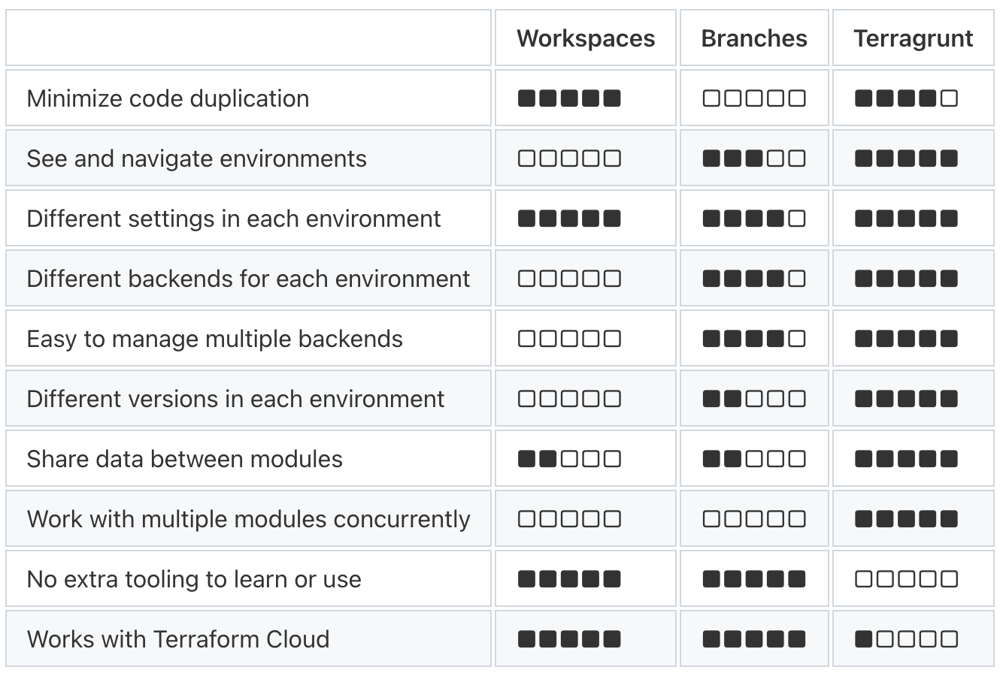
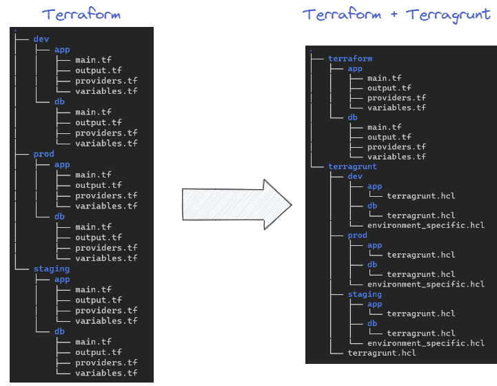

## Terragrunt - DRY
### don't repeat yourself

Surcouche de terraform  
Corrige plusieurs problématique de terraform (multi-env, code propre..)  
Ré-utiliser les portions de code via des configurations partagés  

---

# Dry ?

<!-- .slide: data-background="#009485" -->
<!-- .slide: class="center" -->

---

## Multi-env comparaison

---

## Multi-env avec Terraform

Inutile pour une projet perso  

Mais un vrai projet est souvent composé de plusieurs env :
- DEV
- ...
- STAGE1
- STAGE2
- ...
- PROD

---

## Multi-env avec Terraform

Generaliser les providers  
Generaliser les versions  
Generaliser les variables, locals, data, etc.  

