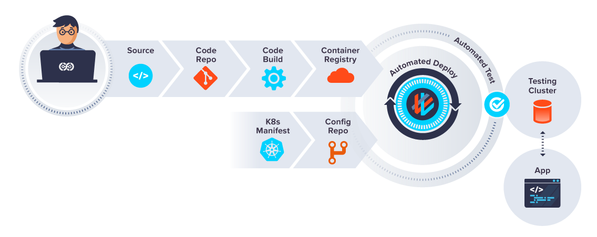
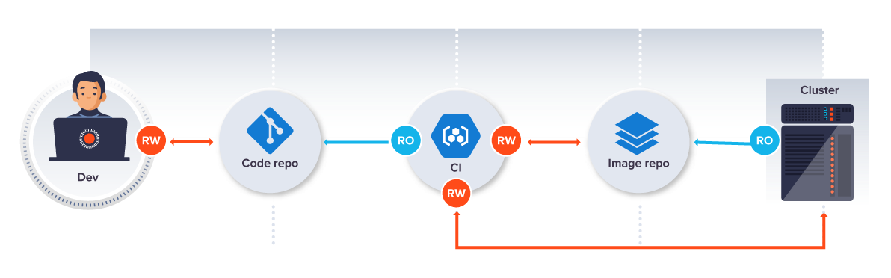
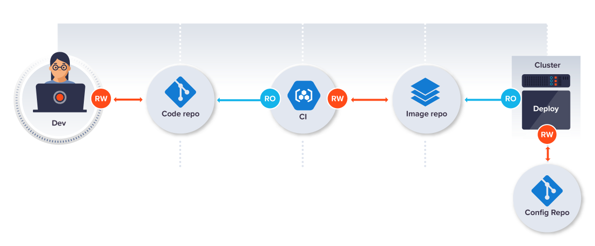
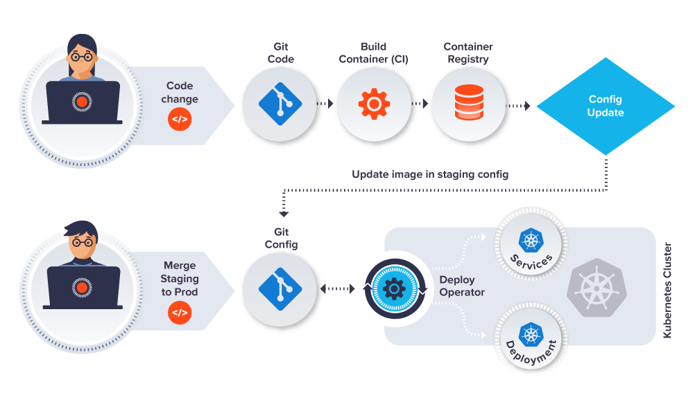

## GitOps - C'est quoi ?  

Modèle d'opération pour Kubernetes et autre technologies cloud-native  
Gère l'infrastructure et la configuration de l'application  
Donne d'avantage de contrôle sur le cycle de l'application  

---

## GitOps - Principes de base  

- Git est la source de vérité
- Déclaratif
- Versionné et immutable
- Système de **pull** automatique (ArgoCD, FluxCD)
- Reconcilation automatique
- Infrastucture et workflow consistent et standardisé

---

## GitOps - Atouts  

- Deploiement & productivité plus rapide
- Améliorer l'audit des modifications (Merge request, comment, etc)
- Grande résilience via Git -> rollback facile

---

## GitOps - Example d'une pipeline  

Git: Github, Gitlab  
Registry: ACR, ECR, Artifactory  
Build server: CI, Action, Jenkins  
Orchestrateur container: Kubernetes  
GitOps Agent: FluxCD, ArgoCD  
Package Kubernetes manifest: Helm, Kustomize  
Monitoring: Grafana, Datadog  

<!-- .element: class="r-stretch" -->
---

## GitOps - Type de modèle 1/2

**Push**  
- Principe de base d'une CI/CD
- Pousse les artifacts, Image, Build etc. sur un dépôt distant

<!-- .element: class="r-stretch" -->

---

## GitOps - Type de modèle 2/2
**Pull**  
- Le cluster est en permanence réconciliation
- Il récupère image, fichier de configuration, etc 

<!-- .element: class="r-stretch" -->

---

## GitOps - ArgoCD et FluxCD  
- Un **opérateur** est un système qui tourne sur le cluster
- A pour objectif de monitorer et déployer selon une configuration
- Pour monitorer ces états il utilise des **CRD**
- Le model Pull est utilisé, et evite d'exposer certains secrets ou token en dehors du cluster  

<!-- .element: class="r-stretch" -->

