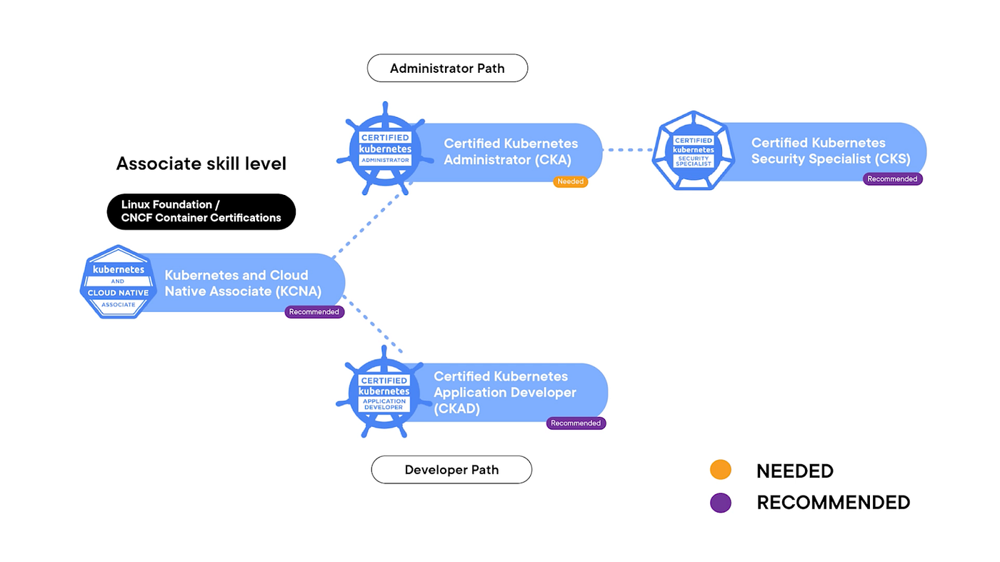
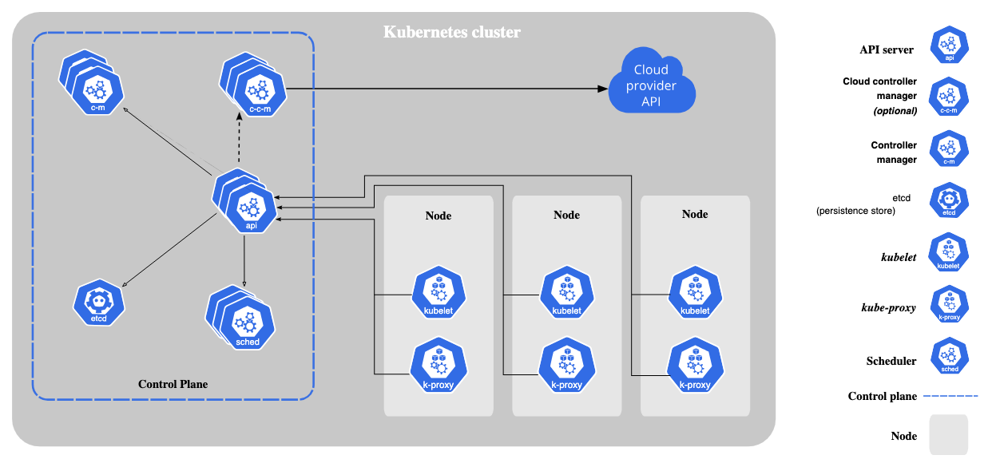
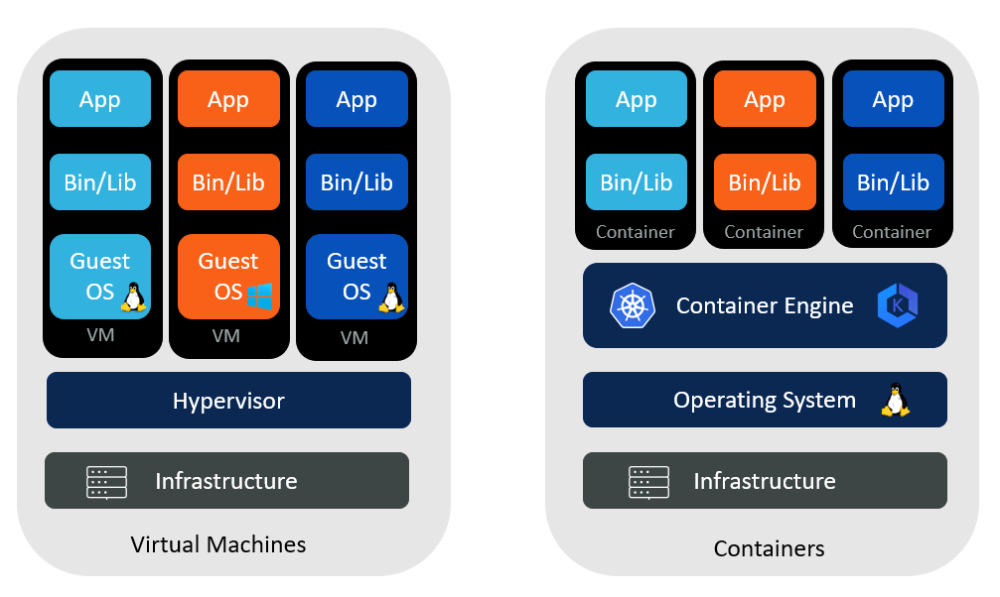
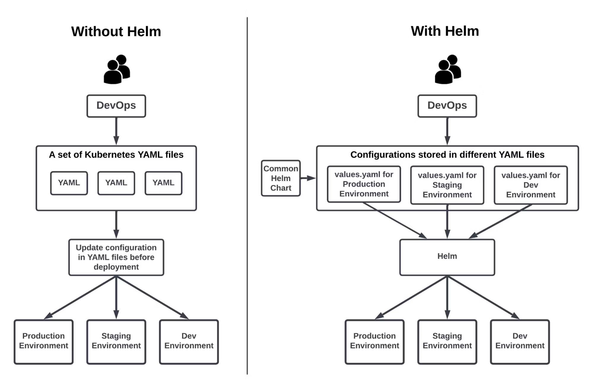

## Hello ! 


2 ans Fullstack Engineer - Thales<br>
2 ans DevOps Engineer - Thales<br>
2 ans+ Platform Engineer - Betclic<br>

</br></br>

**Et vous ?**


---


## Certification liste




---


## Examen

- 60 questions à choix multiples  
- 75 % de bonnes réponses requises  
- Durée : 90 minutes  
- Aucun point négatif (pas de malus)  
- Certification valable 2 ans  
- 1 tentative de rattrapage autorisée


---


## Objectifs de la journée

- Comprendre Kubernetes, son architecture et ses fondamentaux
- Se familiariser avec l’orchestration de conteneurs
- Découvrir l’architecture Cloud Native et les bonnes pratiques
- Comprendre l’observabilité et le delivery dans l’écosystème Kubernetes
- Se préparer à la certification KCNA (Kubernetes & Cloud Native Associate)

</br></br>


| Domaine                           | % de l'examen | Temps alloué |
| --------------------------------- | ------------- | ------------ |
| Kubernetes Fundamentals           | 46%           | 3h13         |
| Container Orchestration           | 22%           | 1h32         |
| Cloud Native Architecture         | 16%           | 1h07         |
| Cloud Native Observability        | 8%            | 34min        |
| Cloud Native Application Delivery | 8%            | 34min        |


---

# Kubernetes Fundamentals
#### Resources, Archi, API, Containers, Scheduling...

<!-- .slide: data-background="#009485" -->
<!-- .slide: class="center" -->


---


## Kubernetes - Historique & Cas d’usage 

**🕰️ Un peu d’histoire**

- 🧪 Inspiré de l’outil interne de Google : **Borg**
- 📅 Open source depuis 2014
- 🤝 Donné à la **CNCF** en 2015

</br></br>

**🧰 Cas d’usage courants**

- Déploiement d’applications microservices
- CI/CD avec gestion automatisée des mises à jour
- Scalabilité horizontale automatique
- Haute disponibilité et auto-réparation

</br></br>

💡 Kubernetes est devenu un **standard** de fait dans le cloud native 🌐


---


## Architecture de Kubernetes - Control plane

Le **Control Plane** orchestre l’état global du cluster.

**🔧 Composants principaux**

- 🧭 **kube-apiserver**  
  Point d’entrée (REST API) – communication centralisée.
- 📘 **etcd**  
  Base de données clé/valeur — état du cluster.
- 🧠 **kube-scheduler**  
  Planifie les pods sur les nœuds.
- 🛡️ **kube-controller-manager**  
  Gère les boucles de contrôle (daemonset, node, namespace...).
- 🔐 **cloud-controller-manager** *(optionnel)*  
  Intégration cloud provider (load balancers, volumes...).

**💡 Fonctionnement :**

- Tu appliques un manifeste → `kube-apiserver` l’enregistre dans `etcd`.
- `scheduler` choisit un nœud → `controller-manager` s’assure que l’état voulu est atteint.
  


---


## Architecture de Kubernetes - Worker node

Chaque **Worker Node** exécute les pods applicatifs.

**🔩 Composants principaux** 

- 🧱 **kubelet**  
  Agent qui communique avec le control plane.  
  → Exécute les pods, assure leur santé.
- 📦 **container runtime**  
  Ex: `containerd`, `CRI-O`, `Docker`  
  → Lance les conteneurs définis dans les pods.
- 🌐 **kube-proxy**  
  Gère le réseau, le routage interne des services.

</br></br>

📦 **Les pods sont lancés ici**, pas sur le control plane !  
Chaque nœud est contrôlé par le scheduler et le control plane.


---


## Architecture de Kubernetes - Schéma




---


## VMs vs Container - Rappels 

|             | **VM (Virtual Machine)** | **Container**                |
| ----------- | ------------------------ | ---------------------------- |
| OS inclus   | ✅ Oui (OS complet)       | ❌ Non (partage du noyau)     |
| Démarrage   | 🐢 Lent (minutes)         | ⚡ Rapide (secondes)          |
| Isolation   | 🔒 Forte                  | 🧩 Plus légère                |
| Poids       | 📦 Lourd (Go)             | 🪶 Léger (Mo)                 |
| Portabilité | 🔁 Moins portable         | 🌍 Très portable              |
| Cas d'usage | 🏢 Legacy, multi-OS       | ☁️ Microservices, cloud natif |

- Les conteneurs sont idéaux pour des déploiements rapides, reproductibles et efficaces
- Les VM restent utiles pour l’isolation forte et les environnements hétérogènes.





---


## Docker & container - Rappels

**Qu’est-ce qu’un conteneur ?**  

- Un **environnement isolé** pour exécuter une application  
- Contient tout ce qu’il faut : code, librairies, dépendances  
- Léger, rapide à démarrer ⚡  
- Identique en dev, test, prod 📦

</br></br>

**Docker 🔧**  

- Plateforme la plus populaire pour **créer, exécuter et gérer des conteneurs**  
- Utilise une image comme **modèle** pour lancer des conteneurs  
- Commandes clés :

```bash
docker build -t monapp .
docker run -p 8080:80 monapp
docker ps
```

</br></br>

💡 Kubernetes orchestre les conteneurs créés avec Docker ou d'autres runtimes comme containerd


---


## KubeCTL

Utilisé pour interagir avec l'API Server de Kube

**💡 Tips**
- `kubectl get pods` → voir les pods
- `kubectl describe pod mon-pod` → détails
- `kubectl delete -f mon-fichier.yaml` → suppression

</br></br>

**Commandes disponible** 

- annotation  
- **apply**  
- auth
- autoscale
- cp
- **create**
- **delete**
- **describe**


---


## Exemple de manifeste YAML (Pod)

```yaml
apiVersion: v1
kind: Pod
metadata:
  name: mon-pod
spec:
  containers:
    - name: nginx
      image: nginx:latest
```

```bash
kubectl apply -f mon-fichier.yaml
```

</br></br>

- Envoie un **fichier manifeste** au serveur Kubernetes.
- Kubernetes **interprète** le YAML pour créer/modifier la ressource déclarée.


---


## Pods – L'unité de base dans Kubernetes

- Plus petite unité déployable dans Kubernetes  
- Contient un ou plusieurs **conteneurs** partageant le même réseau et stockage  
- Cycle de vie lié, s'exécutent sur un **Node** du cluster

**Caractéristiques**  

- Partage d’IP et de ports entre les conteneurs du Pod 🌐  
- Éphémère : les Pods peuvent être recréés, remplacés, mais ne sont pas persistants  
- Géré par des contrôleurs comme **Deployment**, **ReplicaSet**

```yaml
apiVersion: v1
kind: Pod
metadata:
  name: example-pod
spec:
  containers:
  - name: nginx-container
    image: nginx:latest
```

</br>

💡 Les Pods sont la **brique de base** sur laquelle Kubernetes construit des applications complexes


---


## Replicaset – Maintien du nombre de Pods

- Ressource Kubernetes qui garantit un **nombre fixe de Pods** en fonctionnement  
- Crée ou supprime des Pods pour correspondre au nombre désiré  
- Assure la haute disponibilité des applications

**Fonctionnement**  

- Utilise un **label selector** pour gérer les Pods ciblés  
- **Déployé généralement via un Deployment** (rarement seul)

```yaml
apiVersion: apps/v1
kind: ReplicaSet
metadata:
  name: myapp-replicaset
spec:
  replicas: 3
  selector:
    matchLabels:
      app: myapp
  template:
    metadata:
      labels:
        app: myapp
    spec:
      containers:
      - name: myapp-container
        image: nginx:latest
```

</br>
💡 ReplicaSet assure la résilience en maintenant toujours le bon nombre de Pods


---


## Deployments – Gestion des applications

- Ressource Kubernetes qui gère le **déploiement et la mise à jour** des Pods  
- Assure le nombre désiré de réplicas disponibles 🔄  
- Permet le **rolling update** sans interruption de service  

**Fonctionnalités clés**  

- Scaling automatique ou manuel 📈📉  
- Rollback automatique en cas d’erreur ⏪  
- Stratégies de mise à jour (RollingUpdate, Recreate)

```yaml
apiVersion: apps/v1
kind: Deployment
metadata:
  name: app-deployment
spec:
  replicas: 3
  selector:
    matchLabels:
      app: myapp
  template:
    metadata:
      labels:
        app: myapp
    spec:
      containers:
      - name: myapp-container
        image: nginx:latest
```

💡 Deployments simplifient la gestion du cycle de vie des applications dans Kubernetes


---


## Probes

**Liveness Probe**

- Vérifie si le **conteneur est vivant**  
- Si KO ➜ le conteneur est **redémarré**  
- Exemple : boucle infinie ou process bloqué

**Readiness Probe**

- Vérifie si le conteneur est **prêt à recevoir du trafic**  
- Si KO ➜ **retiré** du Service  
- Exemple : temps d'initialisation long ⏳

**Startup Probe**

- Vérifie si l'application a **bien démarré**  
- Utile pour éviter que liveness redémarre trop tôt 🚫  
- Une fois OK ➜ les deux autres probes prennent le relais

```yaml
livenessProbe:
  httpGet:
    path: /healthz
    port: 8080
```

💡 Les probes assurent la **stabilité et la fiabilité** de vos applications dans Kubernetes 🔄


---


## Selecteur, Labels & Annotations

**🏷️ Labels – pour sélectionner & organiser**  

- **Paires clé/valeur** attachées aux objets Kubernetes  
- Utilisés pour la **sélection** (ex : par un Service, ReplicaSet...)  
```yaml
labels:
  app: frontend
  tier: web
```

➡️ Permet de cibler un groupe d’objets via `kubectl` ou des sélecteurs

</br>

**📝 Annotations – pour ajouter du contexte** 

- Aussi des **paires clé/valeur**, mais **non utilisées pour la sélection**  
- Utiles pour stocker des **métadonnées** : version, checksum, info CI/CD, etc.  
```yaml
annotations:
  git-commit: "abc123"
  maintainer: "dev@exemple.com"
```

Labels = pour **filtrer & organiser** 🧩  
Annotations = pour **documenter sans impacter le comportement** 🗒️


---


## Stateless vs Stateful 

**Stateless**  

- Pas de conservation d’état entre les requêtes  
- Chaque requête est indépendante  
- Facile à scaler horizontalement  
- Exemple : serveur web statique, API REST sans session

</br>

**Stateful**  

- Conservation d’état entre les requêtes  
- Nécessite gestion de la session ou des données persistantes  
- Plus complexe à scaler et à gérer  
- Exemple : base de données, applications avec session utilisateur

</br></br>

💡 Kubernetes favorise les workloads **stateless**, mais supporte aussi les **stateful** via StatefulSets, PV, PVC


---


## Namespaces - Isolation & Organisation

- Espace virtuel pour **isoler et organiser** les ressources Kubernetes  
- Permet de gérer plusieurs environnements ou équipes sur un même cluster   
- Les noms des ressources sont uniques **dans un namespace** (pas globalement)

</br></br>

**Utilités**  

- Séparer dev, test, prod  
- Appliquer des politiques RBAC différentes   
- Limiter les ressources consommées par namespace 

```bash
kubectl get namespaces
kubectl create namespace mon-projet
```

</br></br>

💡 Les namespaces facilitent la **gestion multi-tenant** et la sécurité dans Kubernetes 🔄

---


## Services 

- Permettent d’exposer des **Pods** de manière stable (même si les Pods changent)
- Assurent la **découverte de services** via DNS interne
- Fournissent un **load balancing interne** 🔄

**🎯 Types de Services**

- **ClusterIP** (par défaut) : accès interne au cluster  
- **NodePort** : accès externe via un port sur chaque nœud  
- **LoadBalancer** : provisionne un load balancer cloud  
- **ExternalName** : redirige vers un nom DNS externe  


💡 Un Service découple les clients de la complexité des Pods 🧩
```yaml
apiVersion: v1
kind: Service
metadata:
  name: myservice
spec:
  selector:
    app: myapp
  ports:
    - port: 80
      targetPort: 80
```

Client ---> [Service] ---> [Pods avec les bons labels]  
          (IP stable)       (IPs dynamiques)


---


## Volumes 

- Espace de stockage **monté dans un pod**  
- Permet de **persister les données** au-delà du cycle de vie du conteneur  
- Types variés : `emptyDir`, `hostPath`, `configMap`, `secret`, `persistentVolumeClaim`, etc.

**⚙️ Fonctionnement**

- Déclaré dans le spec du pod  
- Utilisé par un ou plusieurs conteneurs via un **mountPath**  
- Garantit la disponibilité des données durant l’exécution du pod

**📝 Exemple simple avec `emptyDir`**  

```yaml
volumes:
- name: cache-volume
  emptyDir: {}
containers:
- name: app
  image: busybox
  volumeMounts:
  - mountPath: /cache
    name: cache-volume
```

💡 Les volumes sont essentiels pour gérer la **durabilité des données** dans Kubernetes


---


## Persistent Volumes

- Ressource **abstraite** représentant un espace de stockage dans le cluster  
- Créée **manuellement** ou **automatiquement** via une StorageClass  
- Utilisée via un `PersistentVolumeClaim` (PVC)

**🔄 Cycle de vie**  

- **Available** → Libre  
- **Bound** → Attaché à un PVC  
- **Released** → Libéré mais pas encore réutilisable  
- **Failed** → Erreur

```yaml
apiVersion: v1
kind: PersistentVolume
metadata:
  name: pv-example
spec:
  capacity:
    storage: 1Gi
  accessModes:
    - ReadWriteOnce
  hostPath:
    path: "/mnt/data"
```

💡 PV = ressource physique ou virtuelle de **stockage durable**, indépendante du pod


---


## Persistent Volume Claim

**📌 Qu’est-ce qu’un PVC ?**

- Requête de **stockage persistant** par un utilisateur ou une application  
- Demande un volume avec une capacité et des caractéristiques spécifiques  
- Lie un Pod à un **Persistent Volume (PV)** disponible

**🧩 Fonctionnement**  

- Kubernetes cherche un PV compatible (capacity, accessModes, storageClass)  
- Une fois trouvé, le PV est **bindé** au PVC  
- Le Pod utilise ensuite le PVC pour accéder au stockage

```yaml
apiVersion: v1
kind: PersistentVolumeClaim
metadata:
  name: pvc-example
spec:
  accessModes:
    - ReadWriteOnce
  resources:
    requests:
      storage: 1Gi
  storageClassName: fast-ssd
```

💡 PVC = interface utilisateur pour demander du stockage persistant dans Kubernetes


--- 


## Storage Class

**📦 Qu’est-ce qu’une StorageClass ?** 

- Définit **le type de stockage dynamique** utilisable par les volumes  
- Utilisée pour provisionner automatiquement un `PersistentVolume` (PV) à partir d’un `PersistentVolumeClaim` (PVC)

**🧰 Paramètres possibles**  

- Type de provisioner (ex: `kubernetes.io/aws-ebs`, `csi`)  
- ReclaimPolicy : `Retain`, `Delete`, `Recycle`  
- AccessModes : `ReadWriteOnce`, `ReadOnlyMany`, `ReadWriteMany`  
- `allowVolumeExpansion`: true/false

```yaml
apiVersion: storage.k8s.io/v1
kind: StorageClass
metadata:
  name: fast-ssd
provisioner: kubernetes.io/aws-ebs
parameters:
  type: gp2
```

💡 Le PVC choisit une `StorageClass` pour demander un **stockage adapté et automatisé**


---


## RBAC et sécurité de base

**👤 ServiceAccounts**  

- Identité utilisée par les **pods** pour s’authentifier auprès de l’API Kubernetes  
- Montée automatiquement dans les pods (`/var/run/secrets/...`)  
- Par défaut : `default` dans chaque namespace  
➡️ Utiliser des comptes dédiés pour les apps sensibles

**🛡️ RBAC (Role-Based Access Control)** 

- Contrôle **qui peut faire quoi** sur quelles ressources  
- Principaux objets :
  - `Role` / `ClusterRole` : ensemble de permissions  
  - `RoleBinding` / `ClusterRoleBinding` : association d’une identité à un rôle


💡 🧠 Combinez **ServiceAccount + RBAC** pour sécuriser les accès applicatifs

```yaml
apiVersion: rbac.authorization.k8s.io/v1
kind: Role
metadata:
  namespace: default
  name: pod-reader
rules:
- apiGroups: [""]
  resources: ["pods"]
  verbs: ["get", "watch", "list"]
```


---


## Exemple : Role + RoleBinding

Donner accès en lecture aux **Secrets** du namespace `dev` à un pod utilisant le `ServiceAccount: reader`

```yaml
# Role : permissions locales
apiVersion: rbac.authorization.k8s.io/v1
kind: Role
metadata:
  name: read-secrets
  namespace: dev
rules:
- apiGroups: [""]
  resources: ["secrets"]
  verbs: ["get", "list"]
```

```yaml
# RoleBinding : attribution à une identité
apiVersion: rbac.authorization.k8s.io/v1
kind: RoleBinding
metadata:
  name: bind-read-secrets
  namespace: dev
subjects:
- kind: ServiceAccount
  name: reader
roleRef:
  kind: Role
  name: read-secrets
  apiGroup: rbac.authorization.k8s.io
```

---


## Exemple : ClusterRole + ClusterRoleBinding

Donner accès en lecture à **tous les pods du cluster** à un `ServiceAccount` nommé `auditor`

```yaml
# ClusterRole : permissions globales
apiVersion: rbac.authorization.k8s.io/v1
kind: ClusterRole
metadata:
  name: read-all-pods
rules:
- apiGroups: [""]
  resources: ["pods"]
  verbs: ["get", "list", "watch"]
```

```yaml
# ClusterRoleBinding : attribution globale
apiVersion: rbac.authorization.k8s.io/v1
kind: ClusterRoleBinding
metadata:
  name: bind-read-all-pods
subjects:
- kind: ServiceAccount
  name: auditor
  namespace: default
roleRef:
  kind: ClusterRole
  name: read-all-pods
  apiGroup: rbac.authorization.k8s.io
```


---


## Kubernetes distributions

**☁️ Cloud-managed**  

- **GKE** (Google Kubernetes Engine)  
- **EKS** (Elastic Kubernetes Service – AWS)  
- **AKS** (Azure Kubernetes Service)  
➡️ Gérés par les fournisseurs cloud, intégrés à leurs services

**🏗️ On-premise & DIY**  

- **kubeadm** : installation manuelle, flexible  
- **RKE** : Rancher Kubernetes Engine  
- **MicroK8s**, **Minikube**, **k3s** : légers, idéals pour dev/test

**🧩 Autres distributions populaires**  

- **RedHat OpenShift** : Kubernetes + outils CI/CD, monitoring, sécurité intégrée (SELinux,APPArmor...)
- **VMware Tanzu**, **Canonical Charmed K8s**, etc.


---


## Questions : Kubernetes Fundamentals

1. Quel composant stocke l'état du cluster ?
2. Quelle est la différence entre un Pod et un Deployment ?
3. Quel type de Service dois-je utiliser pour exposer publiquement un Pod ?
4. Quelle commande permet d'appliquer un fichier YAML ?


---

# Container Orchestration 
#### Container, Runtime, Security, Networking, Service mesh, Storage...

<!-- .slide: data-background="#009485" -->
<!-- .slide: class="center" -->


---


## Runtime 

- Logiciel responsable de **l’exécution des conteneurs** sur chaque nœud  
- Interface entre Kubernetes (via **kubelet**) et le système d’exploitation

**🔄 Compatibilité avec Kubernetes**  

- Kubernetes utilise le standard **Container Runtime Interface (CRI)**  
- Permet d’utiliser différents runtimes conformes :  

| Runtime                            | Langage      | Statut        | Particularités                                                                                                 |
| ---------------------------------- | ------------ | ------------- | -------------------------------------------------------------------------------------------------------------- |
| **containerd**                     | Go           | 🔥 Recommandé | Léger, stable, maintenu par la CNCF. Utilisé par défaut par Kubernetes via `kubelet`.                          |
| **CRI-O**                          | Go           | ✅ Stable      | Minimaliste, conçu spécifiquement pour Kubernetes et 100 % compatible avec CRI. Utilisé par Red Hat/OpenShift. |
| **Docker (dockershim)**            | Go           | ❌ Déprécié    | Docker a longtemps été utilisé, mais **n'est plus supporté** directement par Kubernetes depuis v1.24.          |
| **gVisor**                         | Go/C         | ✅ Stable      | Sandbox avec isolation accrue (Google). Moins performant mais plus sécurisé.                                   |
| **Kata Containers**                | Rust/C       | ✅ Stable      | Chaque conteneur tourne dans une VM légère. Très sécurisé.                                                     |
| **Wasmtime / runwasi**             | Rust         | 🧪 En test    | Permet d’exécuter du WebAssembly (WASM) à la place des conteneurs classiques.                                  |
| **MirageOS / Nabla / Firecracker** | OCaml / Rust | Expérimentaux | Runtimes ultra-légers et sécurisés pour des cas très spécifiques (IoT, serverless, etc.)                       |


**📦 Rôle du runtime**  

- Télécharger les images  
- Créer, exécuter, stopper et supprimer les conteneurs  
- Gérer les volumes et le réseau


---


## Helm

**📦 Qu’est-ce que Helm ?**  
**Gestionnaire de packages Kubernetes**  
Permet d’installer, configurer et maintenir des applications via des **charts**

**🧩 Concepts clés**  

- **Chart** : ensemble de fichiers YAML modélisant une app (templates + valeurs)  
- **Values.yaml** : fichier de configuration personnalisable  
- **Release** : instance déployée d’un chart

**🚀 Commandes utiles**  
```bash
helm repo add bitnami https://charts.bitnami.com/bitnami
helm install myapp bitnami/nginx
helm upgrade myapp bitnami/nginx --set service.type=NodePort
```

💡 Helm = gain de temps, réutilisabilité, déploiements propres & reproductibles


---



---


## Kustomize 

- Outil natif Kubernetes pour **personnaliser les manifests YAML**  
- Permet de créer des variantes sans dupliquer les fichiers  
- Basé sur une approche **patch & overlay**

</br></br>

**Fonctionnalités clés** 

- Ajout/modification de labels, annotations  
- Fusion ou remplacement de champs dans les manifests  
- Gestion de plusieurs environnements (dev, staging, prod) facilement  

</br></br>

💡 Kustomize facilite la **gestion déclarative** et la réutilisation des configurations Kubernetes


---


## Kustomize - Exemple

```bash
myapp/
├── base/
│   ├── deployment.yaml
│   └── kustomization.yaml
└── overlays/
    └── prod/
        ├── kustomization.yaml
        └── patch.yaml
```

```bash
# base/deploy.yaml
apiVersion: apps/v1
kind: Deployment
spec:
  replicas: 1
```

```bash
# base/kustomization.yaml
resources:
  - deployment.yaml
```

```bash
# overlays/prod/patch.yaml
apiVersion: apps/v1
kind: Deployment
metadata:
  name: myapp
spec:
  replicas: 3
```

```bash
# overlays/prod/kustomization.yaml
resources:
  - ../../base
patchesStrategicMerge:
  - patch.yaml
```


---


## Jobs 

- Exécutent une **tâche unique** jusqu’à réussite  
- Utilisés pour des traitements batch, migrations, scripts d’initialisation  
- Gérés automatiquement (relances si échec)

```yaml
apiVersion: batch/v1
kind: Job
metadata:
  name: hello-job
spec:
  template:
    spec:
      containers:
      - name: hello
        image: busybox
        command: ["echo", "Hello KCNA!"]
      restartPolicy: Never
  backoffLimit: 3
```


---


## CronJobs

- Planifient des **Jobs à intervalles réguliers**  
- Syntaxe similaire à `cron` (ex: `0 * * * *`)  
- Exemples : sauvegardes, envois récurrents, tâches de nettoyage

```yaml
apiVersion: batch/v1
kind: CronJob
metadata:
  name: hello-cronjob
spec:
  schedule: "*/5 * * * *"
  jobTemplate:
    spec:
      template:
        spec:
          containers:
          - name: hello
            image: busybox
            command: ["echo", "Hello every 5 minutes!"]
          restartPolicy: OnFailure
```


---


## Autoscaling des Pods

Permet d'ajuster à la demande, sans aucune intervention manuelle, les ressources en CPU/RAM  

S'adapte selon le traffic users, selon des règles & events

</br>

**Horizontal Pod Autoscaler (HPA)**  

- Ajuste automatiquement le nombre de pods en fonction de métriques (CPU, mémoire, custom)  
- Permet de gérer la charge variable sans intervention manuelle  

**Vertical Pod Autoscaler (VPA)**  

- Ajuste automatiquement les ressources (CPU, mémoire) allouées aux pods  
- Optimise les performances sans changer le nombre de pods  
- ⚠️ Ne scale pas le nombre de pods, seulement les ressources allouées.
- ⚠️ Requiert souvent des redémarrages de pods → impact potentiel sur la disponibilité.


---


## Autoscaling des Nodes

**Cluster Autoscaler (CA)**  

- Ajuste automatiquement le nombre de nœuds du cluster selon la charge  
- Supprime les nœuds inutilisés pour optimiser les coûts  

**Karpenter**  

- Autoscaler dynamique et intelligent, développé par AWS  
- Optimise la planification des nœuds, rapide et flexible  
- Supporte divers fournisseurs cloud et configurations

💡 **Autoscaling global = meilleure disponibilité et maîtrise des coûts**


---


## Serverless & Function as a Service (FaaS)

**Qu’est-ce que le Serverless ?**  

- Exécution de code sans gérer l’infrastructure serveur  
- Facturation à l’usage (par invocation ou durée d’exécution)  
- Auto-scalabilité automatique

**Function as a Service (FaaS)**  

- Micro-fonctions légères déclenchées par des événements  
- Exemple : AWS Lambda, Azure Functions, Google Cloud Functions

**OpenFaaS**  

- Plateforme FaaS open-source pour Kubernetes  
- Déploiement simple de fonctions en conteneurs  
- Intégration facile avec Kubernetes, auto-scaling inclus  
- Supporte multiples langages et frameworks

💡 Serverless simplifie le déploiement et la gestion d’applications événementielles


---


## Open Standards

**Qu’est-ce qu’un Open Standard ?**  

- Norme **ouverte et publique**, accessible à tous  
- Développée et maintenue par une communauté ou un organisme indépendant  
- Favorise l’interopérabilité entre différents systèmes et fournisseurs

</br></br>

**Pourquoi c’est important ?** 

- Évite la **dépendance propriétaire** (vendor lock-in)  
- Facilite la collaboration et l’intégration  
- Assure la pérennité et l’évolution des technologies


---


## Open Standards - Exemple

**Exemples dans Kubernetes & Cloud Native** 

- **OpenTelemetry** : standard d’instrumentation et de télémétrie  
- **OCI** (Open Container Initiative) : Format standard des images et la manière dont les conteneurs doivent être exécutés (docker, podman, buildah)
- **CNI** (Container Networking Interface) : Standards ppour connecter les pods à un réseau, gère l’allocation d’IP, la configuration réseau, le routage, etc (calico, cilium)
- **CRI** (Container Runtime Interface) : Standards entre Kubernetes et le runtime de conteneur, permet à k8s de lancer des conteneurs sans dépendre de Docker (containerd, cri-o)

</br></br>

💡 Utiliser des standards ouverts favorise un écosystème robuste et flexible


---


## Custom Resource Definitions (CRDs)

**🔧 Extension de l’API Kubernetes**  

- Permettent de **définir de nouveaux types de ressources** personnalisées  
- Facilite l’ajout de fonctionnalités spécifiques sans modifier le cœur Kubernetes

</br></br>

**🌟 Exemples courants**  

- **cert-manager** : gestion automatisée des certificats SSL/TLS  
- **Prometheus Operator** : gestion simplifiée des instances Prometheus  

</br></br>

💡 **Les CRDs ouvrent la voie à un Kubernetes extensible et adaptable aux besoins métiers !**

```yaml
apiVersion: apiextensions.k8s.io/v1
kind: CustomResourceDefinition
metadata:
  name: monitoring.coreos.com/v1
```


---


## Questions : Orchestration

1. Qu'est-ce qu'un chart Helm ?
2. Différence entre Job et CronJob ?
3. Pourquoi utiliser un CRD ?


---


# Cloud Native Architecture

<!-- .slide: data-background="#009485" -->
<!-- .slide: class="center" -->
---


## Microservices VS Monolitique - Définition

|                    | **Monolithe**                     | **Microservices**               |
|--------------------|----------------------------------|--------------------------------|
| Architecture       | Application unique, tout-en-un   | Application découpée en services indépendants |
| Déploiement        | Un seul déploiement global       | Déploiements indépendants par service          |
| Scalabilité        | Scalabilité globale (tout ou rien) | Scalabilité ciblée par service                  |
| Maintenance        | Complexe et risquée               | Plus simple, services isolés                     |
| Technologies       | Une seule stack souvent           | Possibilité d’utiliser plusieurs stacks         |
| Résilience         | Défauts impactent toute l’app    | Isolation des pannes limitée à un service        |

💡 **Le microservice favorise agilité, évolutivité et résilience, clés du Cloud Native !**


---


## ConfigMaps

- Stockent les **configurations non sensibles** (fichiers de config, variables d’environnement)  
- Séparent la configuration du code → facilite les mises à jour sans redéployer l’app  
- Doivent rester **lisibles** et non sensibles  

</br></br>

💡 **Astuce :** utiliser des volumes ou variables d’environnement pour injecter ConfigMaps/Secrets dans les pods en évitant la duplication.

```yaml
apiVersion: v1
kind: ConfigMap
metadata:
  name: mon-configmap
  namespace: default
data:
  APP_ENV: "production"
  APP_DEBUG: "false"
  DATABASE_URL: "postgres://user:pass@db:5432/ma_db"
```


---


## Secrets

- Stockent les **informations sensibles** (mots de passe, clés API, certificats)  
- Encodés en Base64, mais **pas chiffrés** par défaut → utiliser un gestionnaire externe pour plus de sécurité (ex: Vault)  
- Limiter l’accès aux secrets via les **RBAC**  

💡 **Astuce :** utiliser des volumes ou variables d’environnement pour injecter ConfigMaps/Secrets dans les pods en évitant la duplication.

```yaml
apiVersion: v1
kind: Secret
metadata:
  name: mon-secret
  namespace: default
type: Opaque
data:
  DB_USER: dXNlcg==       # "user" encodé en base64
  DB_PASSWORD: cGFzc3dvcmQ=  # "password" encodé en base64
```


---


## Service Mesh

**Principaux outils**  

- Istio, Linkerd

**Fonctions clés**  

- 🔀 **Routage** avancé du trafic entre services  
- 📊 Collecte de **métriques** fines au niveau service  
- 🔐 Sécurité renforcée via **mTLS** (mutual TLS)  
- Ne modifie pas le code des applications

</br></br>

💡 **Bénéfices** : visibilité, contrôle et sécurité renforcée pour les communications inter-services.


---


## Questions : Architecture

1. Quelle est la responsabilité d'un Service Mesh ?
2. Quelle différence entre Secret et ConfigMap ?
3. Quel composant rend un conteneur stateless ?


---


# Cloud Native Observability
#### Telemetry, Prom, Cost management...

<!-- .slide: data-background="#009485" -->
<!-- .slide: class="center" -->
---


## Prometheus & Grafana

**⬇️ Prometheus**  

- Récupération des métriques par **pull**  
- Stockage et requêtage des données métriques  
- Système d’**alerting** intégré  

**📈 Grafana**  

- Création de **dashboards** visuels personnalisés  
- Visualisation en temps réel des métriques et alertes  
- Supporte plusieurs sources de données  

💡 **Objectif Cloud Native** : surveillance proactive et analyse visuelle centralisée !


---


## Logging et Tracing

**📚 Logging**

- **Fluentd**, **Loki** : collecte, centralisation et recherche des logs  
- Logs essentiels pour le debug et monitoring

**🕵️‍♂️ Tracing**

- **Jaeger** : suivi des requêtes distribuées  
- Analyse des performances et goulots d’étranglement

**📏 OpenTelemetry**

- Standard ouvert d’instrumentation  
- Unifie collecte de métriques, logs, traces

</br></br>

💡 **Focus Cloud Native** : observabilité complète pour diagnostiquer efficacement !


---


## Questions : Observabilité

1. Quelle est la différence entre Prometheus et Grafana ?
2. Quel outil permet de centraliser les logs ?
3. Quel protocole est utilisé pour les traces distribuées ?


---

# Cloud Native Application Delivery
#### Apps fundamentals, GitOps, CI/CD...kcna 
<!-- .slide: data-background="#009485" -->
<!-- .slide: class="center" -->

---


## CI/CD et GitOps

**🔧 CI/CD (Intégration & Déploiement continus)**

- **Jenkins**, **GitLab CI** : automatisent build, tests, déploiement
- Pipelines décrits sous forme de fichiers (`Jenkinsfile`, `.gitlab-ci.yml`)

</br></br>

**🌿 GitOps**

- Déploiement **déclaratif** via Git (source de vérité)
- Ex : **ArgoCD**, **FluxCD**
- Suivi des changements via Git → synchronisation automatique avec le cluster

</br></br>

💡 **Objectif Cloud Native** : automatiser, versionner et sécuriser les déploiements !


---


## Sécurité de livraison 

**🚦 Admission Controllers**  

- Contrôlent et valident les requêtes API avant leur application  
- Permettent d’imposer des politiques de sécurité, conformité, bonnes pratiques  
  
**1. Built-in Admission Controllers**
| Nom                   | Rôle                                                      |
| --------------------- | --------------------------------------------------------- |
| **NamespaceLifecycle**  | Empêche de créer des objets dans des namespaces supprimés |
| **LimitRanger**         | Implique des limites de CPU/mémoire par défaut            |
| **DefaultStorageClass** | Assigne une StorageClass si absente                       |

**2. Dynamic Admission Controllers (Webhooks)**  

📌 Mutating Admission Webhook

- Peut modifier la requête (ex. injection automatique de sidecar Istio)
- Exécuté avant validation

📌 Validating Admission Webhook

- Peut refuser ou valider la requête
- Exécuté après mutation

| Élément                     | Description                                                       |
| --------------------------- | --------------------------------------------------------------    |
| **Admission Controller** | Plugin de l’API Server, mutateur ou validateur                     |
| **Built-in**             | Activé côté kube-apiserver (ex: LimitRanger)                       |
| **Webhook**              | Service HTTP/HTTPS externe, flexible (ex: OPA Gatekeeper, Kyverno) |


---


## Sécurité de livraison 

**🛡️ OPA & Gatekeeper**  

- **OPA (Open Policy Agent)**
  - C’est un moteur de décision généraliste basé sur un langage de policy : Rego.
  - Tu lui envoies des données, il renvoie une décision (allow, deny, etc.).
- **Gatekeeper**
  - Intègre OPA en tant que moteur de policy (controller)
  - Gère les règles et contraintes via des CRDs
  - Se comporte comme un Validating Admission Webhook

```yaml
apiVersion: constraints.gatekeeper.sh/v1beta1
kind: K8sRequiredLabels
metadata:
  name: require-team-label
spec:
  match:
    kinds:
      - apiGroups: [""]
        kinds: ["Pod"]
  parameters:
    labels: ["team"]
```
→ Cela refuse tous les pods qui ne déclarent pas metadata.labels.team.


---


## Sécurité de livraison 

**🔍 Scan d’images**  

- **Trivy**, **Snyk** : détectent vulnérabilités, failles de sécurité dans les images conteneurs  
- Intégration possible dans pipelines CI/CD pour blocage précoce  

</br></br>

💡 **But : garantir la sécurité et la conformité avant déploiement en production !**


---


## Questions : Delivery

1. Qu'est-ce que GitOps ?
2. Quelle est la différence entre un pipeline CI et CD ?
3. Quel outil permet de scanner une image de conteneur ?


---

# CNCF
#### Structure, memberships, boards...

<!-- .slide: data-background="#009485" -->
<!-- .slide: class="center" -->

---


## CNCF – Cloud Native Computing Foundation

Fondation sous la Linux Foundation  
Soutient l’écosystème **Cloud Native**  
Accueille des projets comme Kubernetes, Prometheus...  

</br></br>

**Gouvernance structurée** 
- 📜 **Governing Board** (stratégie & finance)
- 🧠 **Technical Oversight Committee (TOC)** (feuille de route technique)
- 🛠️ **Special Interest Groups (SIGs)** (groupes d’experts thématiques)

</br></br>

| Structure              | Niveau                  | Rôle principal                         | Responsabilités clés                                                 | Membres typiques                      |
| ---------------------- | ----------------------- | -------------------------------------- | -------------------------------------------------------------------- | ------------------------------------- |
| 📜 **Governing Board** | Stratégique             | Vision, stratégie, financement         | Budgets, partenariats, décisions juridiques, croissance du projet    | Représentants des entreprises membres |
| 🧠 **TOC**             | Technique (stratégique) | Supervision technique globale          | Feuille de route, cohérence des projets, validation technique        | Experts techniques élus ou nommés     |
| 🛠️ **SIGs**           | Opérationnel            | Travail technique ciblé sur un domaine | Développement, maintenance, revue de code, support aux contributeurs | Mainteneurs, développeurs             |


---


## CNCF – Governing Board

**🎯 Rôle**  

Le Governing Board est l’instance décisionnelle stratégique et financière d’un projet ou d’une fondation.


**⚙️ Responsabilités principales**  

- Définir la stratégie globale (vision, expansion, partenariats)
- Allouer les budgets (marketing, événements, développement, sécurité, etc.)
- Gérer les relations avec les sponsors, membres fondateurs, et partenaires
- Superviser les aspects juridiques et contractuels
- Valider ou influencer les grandes décisions comme :
  - L’admission de nouveaux projets dans la fondation
  - Les changements de licence
  - Les dépenses exceptionnelles

**👥 Composition**  

Généralement constitué de représentants des entreprises membres (ex : Platinum Members dans la CNCF) ou d’élus.


---


## CNCF – Technical Oversight Committee (TOC)

**🎯 Rôle**  

Le TOC est le garant de la cohérence technique du projet ou de l’écosystème soutenu par la fondation.

**⚙️ Responsabilités principales**  

- Définir la feuille de route technique
- Évaluer les projets candidats à une incubation ou graduation (ex. dans la CNCF : Envoy, Prometheus, OpenTelemetry…)
- Maintenir la cohérence architecturale entre les projets
- Piloter les bonnes pratiques, les exigences de sécurité, d’interopérabilité, de documentation…
- Évaluer les projets abandonnés ou obsolètes

**👥 Composition**  

Des experts techniques indépendants, souvent élus ou nommés par leurs pairs. Ils ont une vision neutre et long terme.


---


## CNCF – Special Interest Groups (SIGs)

**🎯 Rôle**  

Les SIGs sont des groupes de travail thématiques. Ils opèrent au plus près du code et des usages.

**⚙️ Responsabilités principales**  

- Gérer une sous-partie technique du projet ou un domaine fonctionnel spécifique (ex : SIG Networking, SIG Security, SIG Observability…)
- Proposer des améliorations, rédiger des Kubernetes Enhancement Proposals (KEP) ou équivalents
- Revoir du code, proposer des APIs, expérimenter des features
- Servir de point d’entrée pour les contributeurs
- Participer à la documentation, tests et intégration continue

**👥 Composition**  

Ouverts à tous les contributeurs  
Menés par des mainteneurs ou leads, souvent nommés par mérite  
Fonctionnent via des réunions régulières, Slack, mailing lists, GitHub…  


---


## CNCF Tech Radar

- Publication communautaire (trimestrielle)
- Classe les technologies selon l’adoption :
  - ✅ **Adopt**
  - 🔬 **Trial**
  - 🧪 **Assess**
  - 🚫 **Hold**

**Objectif** 

- Aider les équipes à comprendre les tendances réelles
- Donne une **vue concrète** sur ce qui marche en production

📊 Basé sur des retours de membres du End User Community


---


## CNCF Memberships

**Types** 

- 🥇 **Platinum**
  - 1 personne admise au Governing Board
- 🥈 **Gold**
  - 1 personne admise au Governing Board pour 5 members (max 3)
- 🥉 **Silver**
  - 1 personne admise au Governing Board pour 1O members (max 3)
- 👨‍🏫 **Academic / Nonprofit institution**

**Avantages** 

- Visibilité dans la communauté
- Droit de vote au Governing Board (selon le niveau)
- Influence sur la feuille de route CNCF

💡 Plus de 160 membres, dont Google, Red Hat, Microsoft...


---


## Quizz - Examen blanc


---


## Conseils de préparation

- 🎯 **60 questions gratuites** disponibles sur [app.exampro.co](https://app.exampro.co)  
- 💸 **Séries supplémentaires** disponibles sur Udemy (payantes)
- ⏱️ **Entraîne-toi au rythme réel** : ~1min30 par question  
  → Ne reste pas bloqué trop longtemps
- 💡 **Se méfier des pièges de vocabulaire**  
  Lire attentivement chaque proposition.


---


**🎓 Concepts fondamentaux**

- Qu’est-ce qu’un cluster Kubernetes ?
- Architecture : Control Plane vs Workers
- Principales ressources : Pod, Service, Deployment, ConfigMap, Secret

**⚙️ Outils CLI**

- `kubectl` : commandes de base (`get`, `describe`, `logs`, `apply`, `delete`)
- Notions de contexte (`kubectl config use-context`)

**📦 Conteneurs & images**

- Docker / containerd / OCI
- Fichier Dockerfile & `docker build`

**🌐 Réseau & Services**

- ClusterIP, NodePort, LoadBalancer
- DNS interne, communication entre pods

**☁️ Écosystème CNCF**

- Open source, projets CNCF (Prometheus, Helm, etc.)
- CNCF Landscape et notions de Cloud Native

