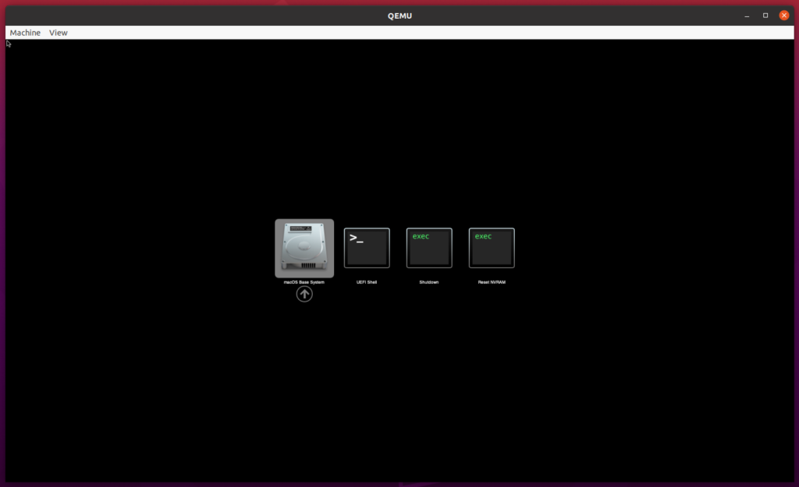
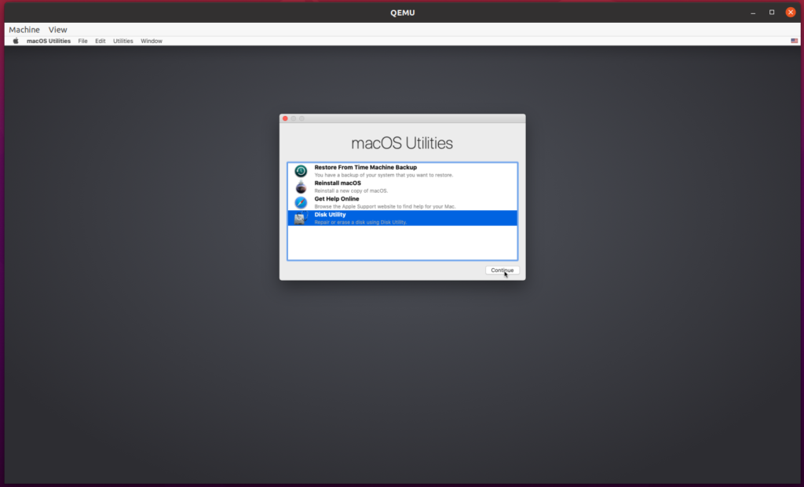
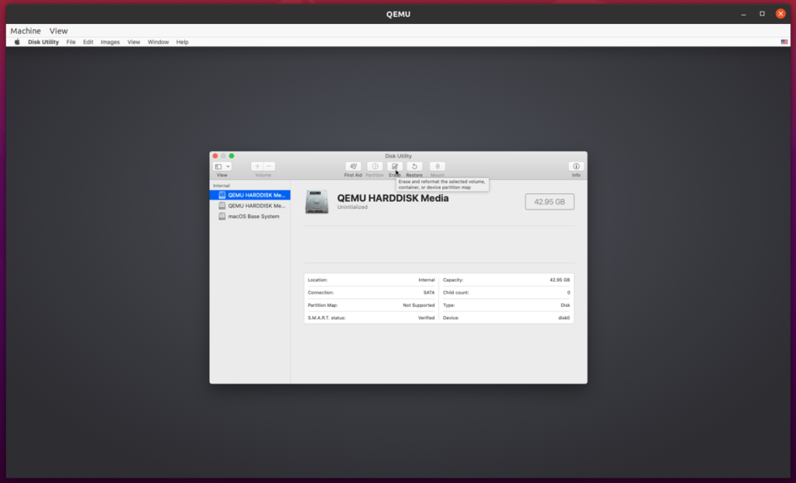
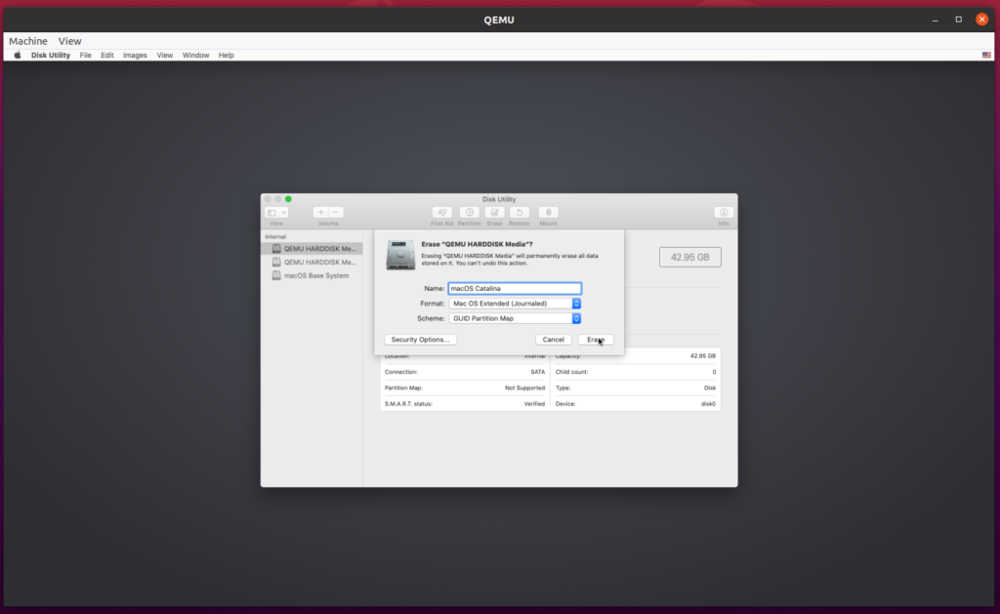
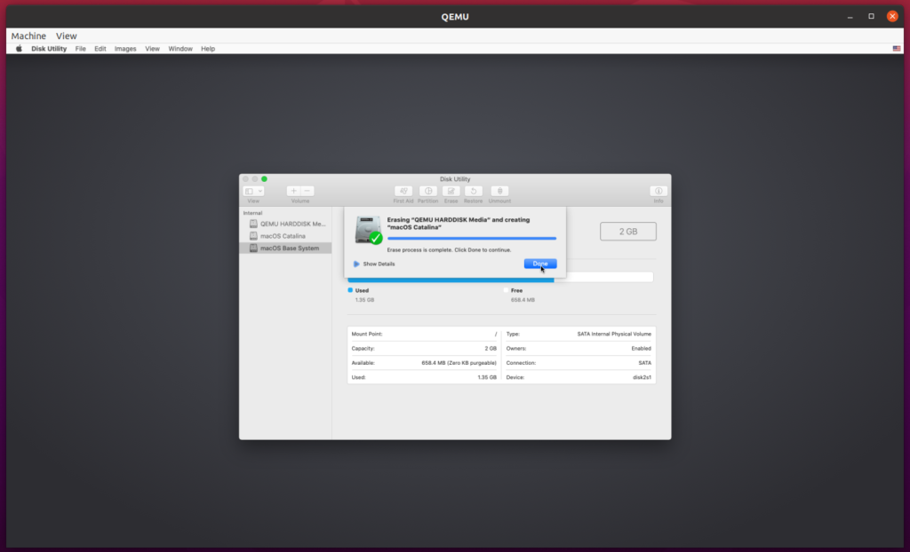
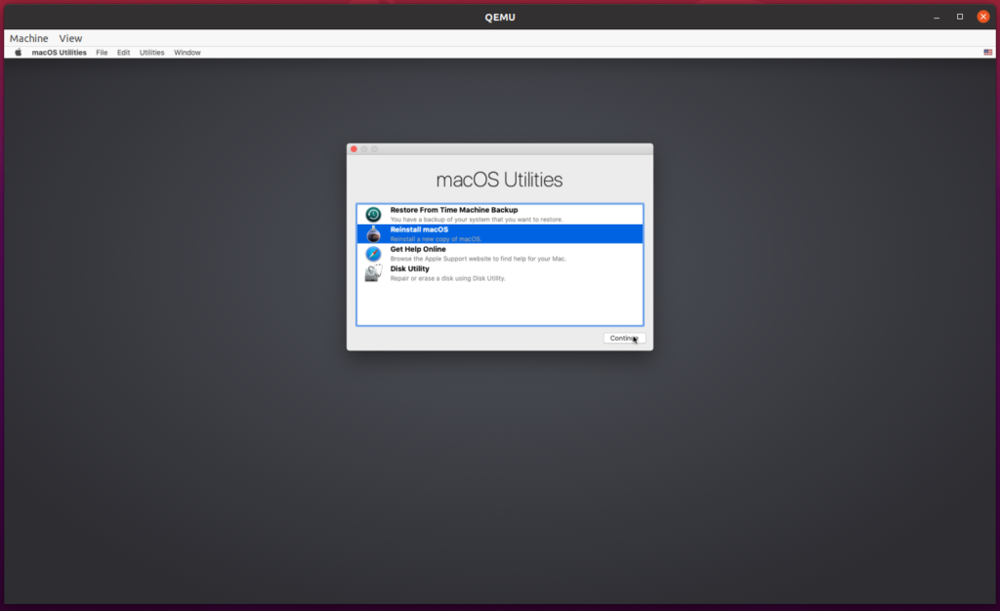
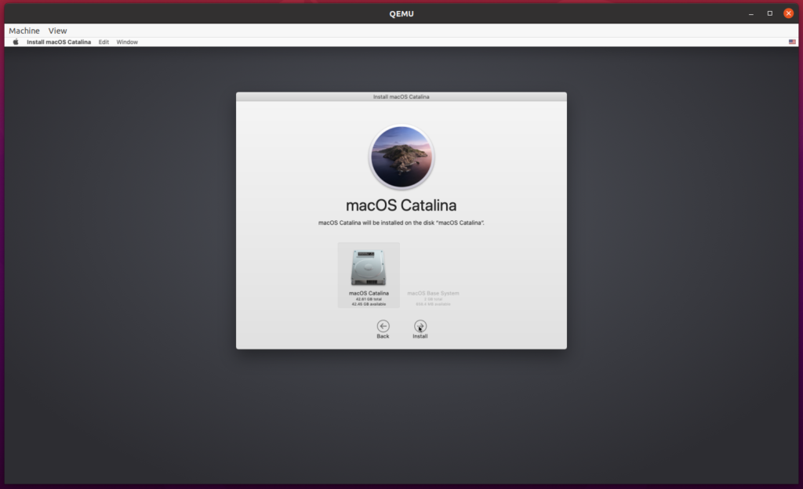
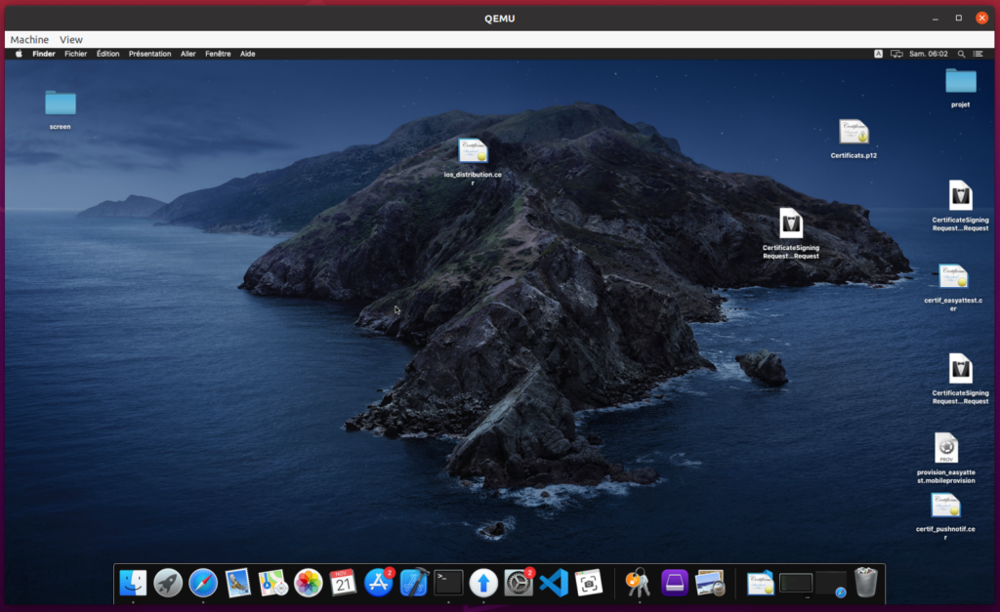

J'ai eu récemment besoin de Catalina afin de builder une application ReactNative pour iOS. Les solutions traditionnels Virtualbox ou encore Vmware m'ont donnée des OS inutilisable, résultant en d'important lag même sur ma config à 4000€. 

Au bout de deux jours de recherche et d'installations en tout genre pour activer l'accélération graphique via GPU, je suis tombé ENFIN sur une option viable, gratuite, et donnant d'excellent résultat sur mon laptop à 500€ qui datent des années 2015 avec un vieux dual-core !

Vous aurez accès à l'ensemble des outils de Apple, XCode, les app stores, etc.

## Prérequis

Désolé les amis, il vous faudra lâché Windows au profit d'une distrib Linux. Donc ayez une machine en dual-boot sous la main, c'est obligatoire.

## Dépôt

J'ai trouvé deux répo intéressant:

- [https://github.com/foxlet/macOS-Simple-KVM](https://github.com/foxlet/macOS-Simple-KVM)
- [https://github.com/kholia/OSX-KVM](https://github.com/kholia/OSX-KVM)

Le premier de Foxlet est le plus simple. Mais celui de Kholia est un poil plus performant, et nous partirons sur celui-ci dans la suite du tuto.

## Pourquoi ?

Foxlet utilise le bootmanager Clover, alors que Kholia Open-core. Open-core est plus jeune, moins robuste, mais semble être plus prometteur et performant. Clover semble être délaissé au profit du jeune OpenCore, la plupart des gros développeur sont partie pour ce dernier.

Vous pouvez y ajouter votre GPU, votre carte son, périphériques USB pour développer sous XCode, etc.

## Installation

On va suivre les infos du dépôts :

- On paramètre KVM
    
    ```bash
    $ echo 1 | sudo tee /sys/module/kvm/parameters/ignore_msrs
    ```
    
    On rend la modification permanente
    
    ```bash
    $ sudo cp kvm.conf /etc/modprobe.d/kvm.conf
    ```
    
- Installation des packages nécessaires
    
    ```bash
    sudo apt-get install qemu uml-utilities virt-manager git wget libguestfs-tools -y
    ```
    
- Clone le répo de Kholia
    
    ```bash
    cd ~
    
    git clone --depth 1 https://github.com/kholia/OSX-KVM.git
    
    cd OSX-KVM
    ```
    
- Lancez le scripts suivant :
    
    ```bash
    ./fetch-macOS.py
    ```
    
    Selectionnez la version de macOS que vous souhaitez installer.
    
    ```bash
    $ ./fetch-macOS.py
     #    ProductID    Version   Post Date  Title
     1    061-26578    10.14.5  2019-10-14  macOS Mojave
     2    061-26589    10.14.6  2019-10-14  macOS Mojave
     3    041-91758    10.13.6  2019-10-19  macOS High Sierra
     4    041-88800    10.14.4  2019-10-23  macOS Mojave
     5    041-90855    10.13.5  2019-10-23  Install macOS High Sierra Beta
     6    061-86291    10.15.3  2020-03-23  macOS Catalina
     7    001-04366    10.15.4  2020-05-04  macOS Catalina
     8    001-15219    10.15.5  2020-06-15  macOS Catalina
     9    001-36735    10.15.6  2020-08-06  macOS Catalina
    10    001-36801    10.15.6  2020-08-12  macOS Catalina
    11    001-51042    10.15.7  2020-09-24  macOS Catalina
    12    001-57224    10.15.7  2020-10-27  macOS Catalina
    13    001-68446    10.15.7  2020-11-11  macOS Catalina
    14    001-79699     11.0.1  2020-11-12  macOS Big Sur
    
    Choose a product to download (1-14): 14
    ```
    
    On a récupérer le BaseSystem.dmg, on va le convertir
    
    ```bash
    qemu-img convert BaseSystem.dmg -O raw BaseSystem.img
    ```
    
- On créer un disque dur virtuel, ou notre distri de macOS sera installé. Attribuez la valeur de stockage comme vous le souhaitez. Sachez que Xcode prends pas mal de place, donc au minimum une partition de 64go me semble correct...
    
    ```bash
    qemu-img create -f qcow2 mac_hdd_ng.img 128G
    ```
    

## Démarrer Catalina

Pour démarrer notre futur macbook pour la première ainsi que les autres sessions, lancez le script suivant :

`./OpenCore-Boot.sh`

On commence par booter sur le disque de base :



Sélectionnez **Disk Utiliy** :



Sélectionnez le disque que vous venez de créer dans les étapes précédentes :



On va cliquer sur **Erase**. Donnez lui un **nom** à notre disque, macOS Catalina par exemple. Validez en cliquant une nouvelle fois sur **Erase** :



Tout est fini. Fermez l'**utilitaire de disque** afin de revenir sur le menu de départ.



Sélectionnez **Reinstall macOS** :



Un tas de chose vont vous être demander, laissez vous guidez à travers l'installation. Acceptez les divers conditions, remplissez votre profil, enregistrer votre compte Apple afin d'avoir accès au store, etc. 

Je vous explique pas chaque détails, c'est plutôt intuitif :



 

Après une vingtaine de minute, votre installation est fini



 

Pour utiliser le plein écran : `Shift + Alt + F`

Pour quitter le focus et revenir sur votre linux : `Shit + Alt + G`
