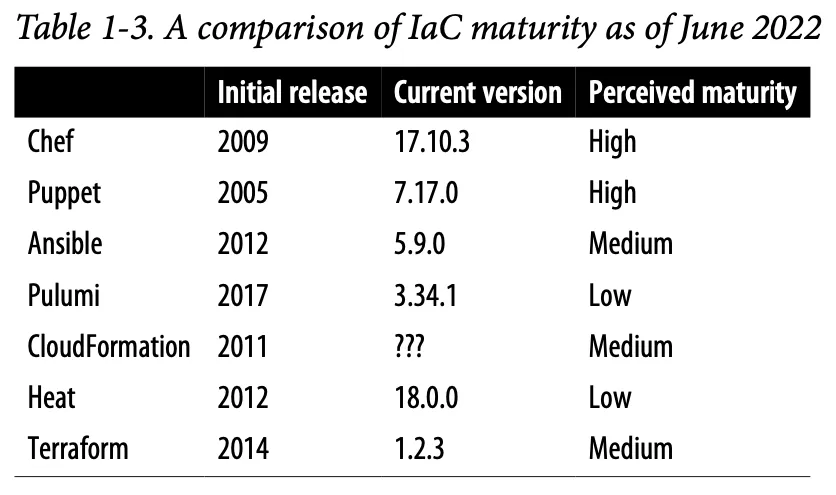
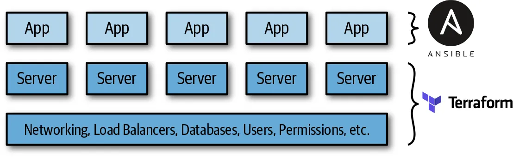
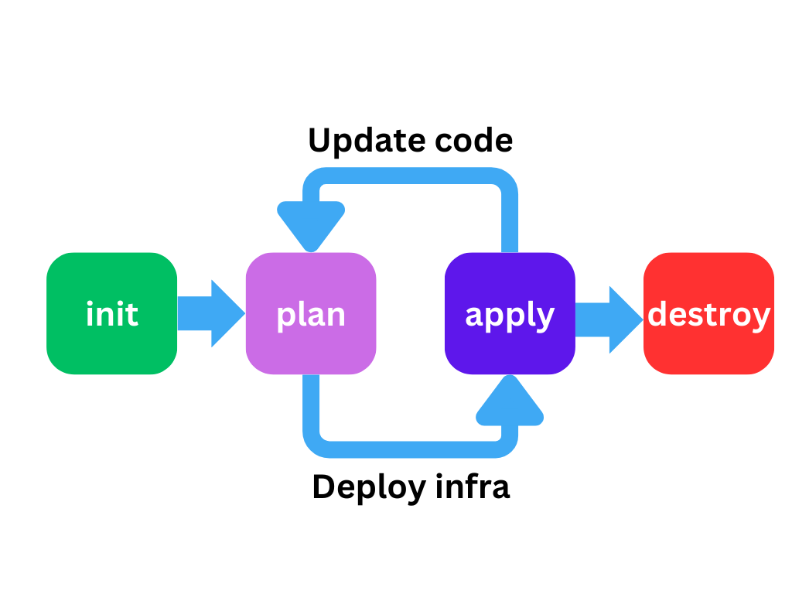

## Infra de base

Création à la main via le portal management

Quid pour une infra plus complexe ?
- Si on a beaucoup de ressources
- Si on gère plusieurs projets
- Avoir une politique d'accès aux ressources
- Suivi du FinOps ? (gérer les ressources utilisés de celles outdated)

---

## Infra as Code

Définir son infra en code  
Dispo sur un répôt Git
 

Atouts : 
- Vision clair de ce qui tourne et sur quelle environnement
- Changelog des ressources crée, détruite ou mis à jour entre chaque commit
- Aucun soucis pour du collaboratif si le répôt est bien structuré
- Meilleure suivi/gestion des ressourcs pour 

---

## IaC Tools comparaison
Liste des principaux IaC framework  
Liste les configurations les plus communes et/ou par defaut
Cf. 

✅ On peut combiner les outils ensemble.  
Exemple, création d'un serveur sous Terraform, et configuration de celui-ci via Ansible

---

## IaC Tools comparaison
### Configuration Management vs Provisioning

Configuration management
- Consiste à installer et manager des softs sur des serveurs déjà existants  

❗❗ Peut faire du provisioning à moindre degrés

Provisioning
- Fait pour créer les serveurs eux-mêmes. Database, load-balancer, storage, etc.

❗❗ Peut faire de la configuration moins facilement via des scripts sur les serveurs fraichement crées

<!-- .element: class="r-stretch" -->

---

## IaC Tools comparaison
### Mutable Infrastructure vs Immutable Infrastructure

**Mutable**: lancer une même commande effectue une 2nd fois des changes
 
**Immutable**: lancer x fois une commande donne le même résultat

<!-- .element: class="r-stretch" -->

---

## IaC Tools comparaison
### Procedural vs Declarative

Le style **procéduriale** décrit étape par étape ce que tu souhaites avoir  
Besoin de savoir ce qui est déployé à l'instant T, et de lancer les commandes dans le bon ordre  

 

Le style **déclaratif** décrit ton souhait final. Tu ne te soucis pas de comment y arriver  
Notion de state qui capture l'état courant de l'infrastructure  

<!-- .element: class="r-stretch" -->

---

## IaC Tools comparaison
### General-purpose language versus domain-specific language

**GPL**: Javascript/Typescript, Python, Go, C#, Java...  
**DSL**: HCL, Puppet Language, YAML, JSON...

<!-- .element: class="r-stretch" -->

---

## IaC Tools comparaison
### Master vs Masterless

**Master**
- Contient le state de l'infrastructure
- Le master applique les changes demandés par le client, aux Agents
- Besoin d'avoir un agent qui run. 
- Le client discute avec le master 

**Masterless**
- Moins d'extra infra à gérer
- Donc moins de maintenance

<!-- .element: class="r-stretch" -->

---

## IaC Tools comparaison
### Agent vs Agentless

Un agent est responsable d'installer la dernière configuration sur chacun des serveurs  
Ajoute de la maintenance supplémentaire

<!-- .element: class="r-stretch" -->

---

## IaC Tools comparaison
### Mature vs Cutting Edge

La maturité d'un projet est déterminé par :
- l'ancienneté
- l'usage apporte des best practices, pattern, etc

<!-- .element: class="r-stretch" -->

---

## Combiner les tools

Chaque outils à ses forces & faiblesses  
Selon le cas d'usage, il se peut d'employer plusieurs outils à la fois

---

## Combiner les tools
### Provisionning + Configuration management

**Ex: Terraform + Ansible**  
Terraform: Deploy le network, database, serveurs, etc.  
Ansible: Deploy nos applications sur les serveurs (approche mutable)  

<!-- .element: class="r-stretch" -->

---

## Combiner les tools
### Provisionning + Server templating

**Ex: Terraform + Packer**  
Terraform: Création de VMs  
Packer: Packager une application et deploy sur la VM via une image (approche immutable)  

<!-- .element: class="r-stretch" -->

---

## Combiner les tools
### Provisionning + Server templating + Orchestration

**Ex: Terraform, Packer, Docker & Kubernetes**  
Packer: VM image qui contient docker + kubernetes  
Terraform: création de cluster de serveurs  

<!-- .element: class="r-stretch" -->

---

## Terraform le GOAT ?

Résumé:
- Open source 
- Grande communauté
- Tool de provisioning
- Infra immutable
- Codebase mature
- Language déclaratif
- Masterless et Agentless
- Multi cloud

---

# Let's go pour Terraform !
<!-- .slide: data-background="#009485" -->
<!-- .slide: class="center" -->

---

## La base de Terraform

Terraform utilise son propre language le **HCL** (ressemble à du JSON)

1. On crée des ressources. 
2. TF calcule l'odre des dépendances à appliquer
3. Terraform 'sauvegarde' l'état final de l'infra dans un fichier **tf.state**

---

## Best practices

Le **tf.state** contient toute la structure de l'infrastucture, celui-ci est donc critique si il est supprimé ou corrompu (ex: un apply qui à été intérompu, 2 apply qui se font en même temps...)  
 
Ce fichier contient les infos en clair. Notemment des tokens, password, etc.  
🚨 Fichier à ne jamais commit sur Git !!  
 
Pour gérer au mieux le travail collaboratif, et la résilience de ce fichier, on préfère utiliser un **remote backend**  
 
Pour les opérations critiques (cf terraform apply) on met en place du **locking**, permettant de faire celles-ci en séquentiel  
 
A privilégier les **shorts term credentials** vs long term (Ex: login sso vs accesKey/secretKey)

---

## Modules

Un module est une sorte d'extention  
Il regroupe du code terraform pour faciliter certaines opérations  
Ils peuvent être créer par sois même, ou même distribué par la communauté en open source  

---

## Les principales commandes

Les main: 
- terraform init
- terraform plan
- terraform apply

  

Les secondaires:
- terraform fmt
- terraform validate

---

## Commande annexes 

- terraform graph
- terraform taint
- terraform import
- terraform workspace
mkd

---
# Un peu de code :)
<!-- .slide: data-background="#009485" -->
<!-- .slide: class="center" -->

---

## Terraform - Providers

<pre class="stretch"><code data-trim data-noescape>
terraform {
    required_providers {
        aws = {
            source  = "hashicorp/aws"
            version = "5.13.1"
        }
    }
}
</code></pre>

---

## Terraform - Providers multiple

<pre class="stretch"><code data-trim data-noescape>
terraform {
    required_providers {
        aws = {
            source  = "hashicorp/aws"
            version = "5.13.1"
        }
    }
}

provider "aws" {
    region = "eu-west-3"
}

provider "aws" {
    alias = "acm_provider"
    region = "us-east-1"
}

resource "aws_acm_certificate" "certificate" {
    provider = aws.acm_provider
    ...
}
</code></pre>

---

## Terraform - Remote backend

<pre class="stretch"><code data-trim data-noescape>
terraform {
    backend "s3" {
    bucket = "bastienmaurice-website-infra-state"
    key    = "terraform/state/terraform.tfstate"
    region = "eu-west-3"

    dynamodb_table = "bastienmaurice-website-infra-state"
    encrypt        = true
  }
}
</code></pre>

---

## Terraform - Locals

<pre class="stretch"><code data-trim data-noescape>
locals {
    toto = "tata"
}
</code></pre>

---

## Terraform - Variables

<pre class="stretch"><code data-trim data-noescape>
variable "ma_var" {
    type = string
}

variable "region_list" {
  type    = list(string)
  default = ["us-west-1a"]
}

variable "docker_ports" {
  type = list(object({
    internal = number
    external = number
    protocol = string
  }))
  default = [
    {
      internal = 8300
      external = 8300
      protocol = "tcp"
    }
  ]
}

</code></pre>

---

## Terraform - Création d'une ressource

<pre class="stretch"><code data-trim data-noescape>
resource "aws_s3_bucket" "bucket" {
  bucket = "mon-bucket"
}
</code></pre>

