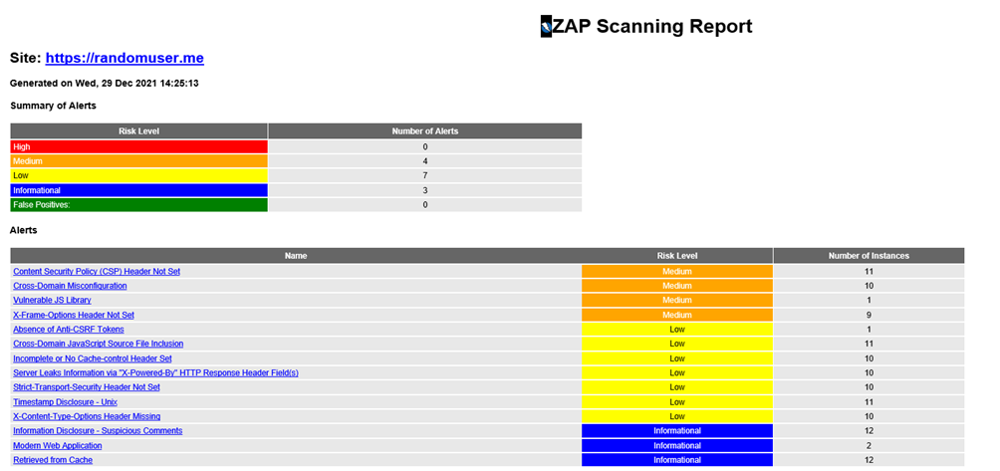
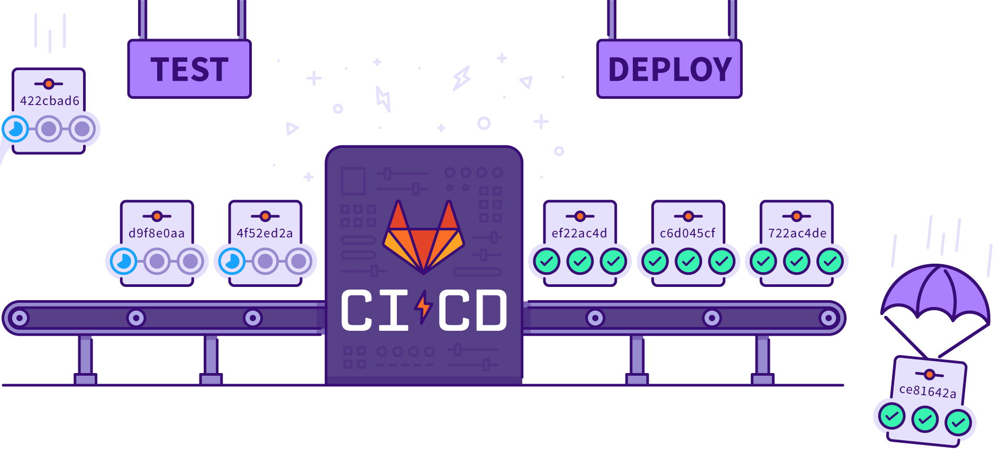

## Cycle de developpement traditionnel

Chaque dév ajoute des features et pousse en prod    
Absence de responsabilité autour de la sécurité  
Tests effectués en fin de cycle  
La sécurité est traité à part  

 <!-- .element: class="r-stretch" -->

---

## Conséquences

- Deploiement en prod long
- Et/ou risque de vulnérabilités si besoin de hotfix

---

## Shift Left
DevOps:
- Focus & rapprochement entre team de dev et d'ops

DevSecOps:
- Focus & rapprochement en plus des team de sécu

---

## Shift Left

Approche qui combine équipe de sécurité et d'opération  
Responsabilité de chacun  
Aborder la sécurité au plus tôt dans le cycle de dev d'une application  
Décalage vers la gauche du traditionnel cycle de dev  

---

## Shift Left - Atouts

- Meilleure collaboration entre équipe  
- Meilleure qualité du produit  
    - Moins de vulnérabilité, détécté plus tôt  
    - Plus de mise à jour et donc d'optimisation  
- Diminution des couts  

---

## SAST - Static Application Security Testing

Scan le code source de l'application  

Ex:  
NodeJS -> npm audit  
Container Docker -> Trivy  
IaC -> Kics, Terrascan  
Cloud Provider -> Prowler  
Leaks -> GitLeaks  

 <!-- .element: class="r-stretch" -->
---

## DAST - Dynamic Application Security Testing

Scan l'application une fois deployé

Ex:  
App web -> OWASP Zap Proxy  

 <!-- .element: class="r-stretch"-->

---
# Shift Left
## Comment le mettre en place ?

<!-- .slide: data-background="#009485" -->
<!-- .slide: class="center" -->

---

## DevSecOps - Automatisation

Ne pas attendre un incident de sécurité :
- Automatisation via CI/CD
- Ajout de nouveau stage de tests 

<!-- .element: class="r-stretch" -->

---

## DevSecOps - Nightly

Test en continu :
- Mise en place de Nightly (Pentest, load/chaos test, etc.)

---

## DevSecOps - Monitoring

Suivre en continu métriques, logs applicatifs, etc :
- Dashboard (Datadog, Grafana)

 <!-- .element: class="r-stretch" -->

---

## DevSecOps - Alerting

Alerter sur les vulnérabilités le plus vite :
- Alerting (PagerDuty)

 <!-- .element: class="r-stretch" -->

